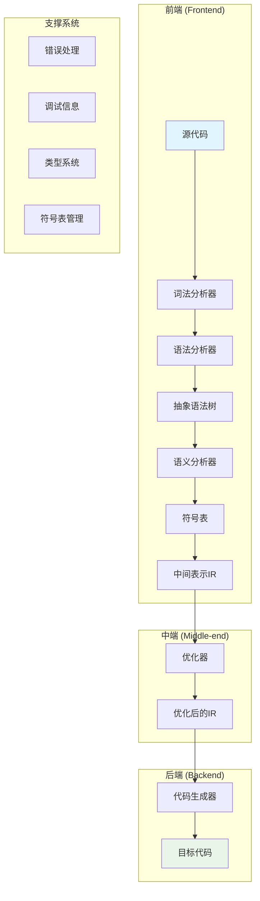
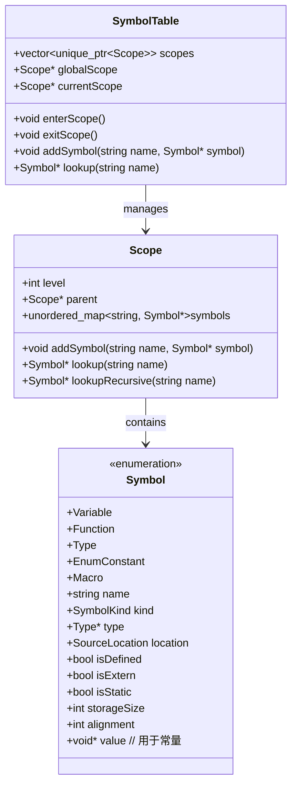
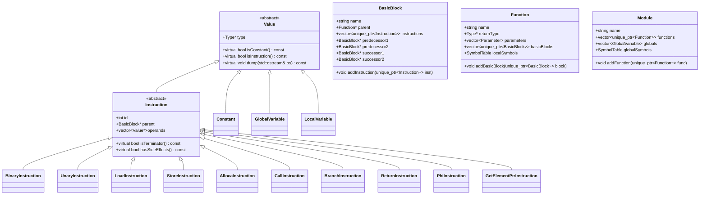
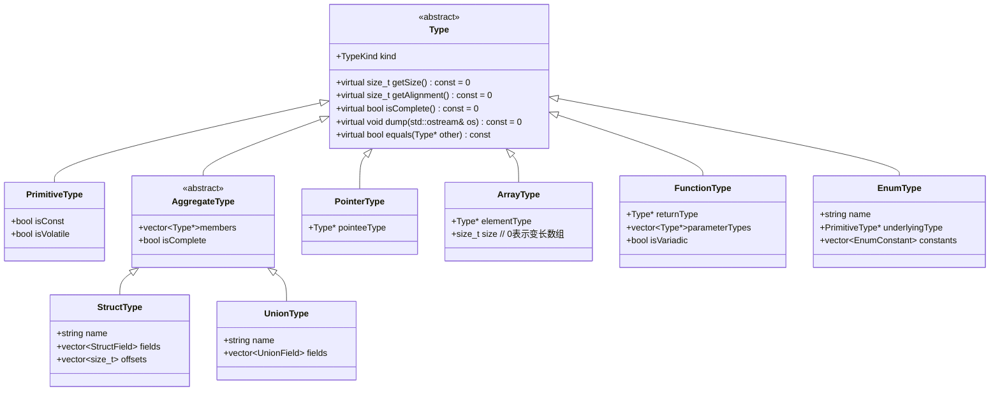
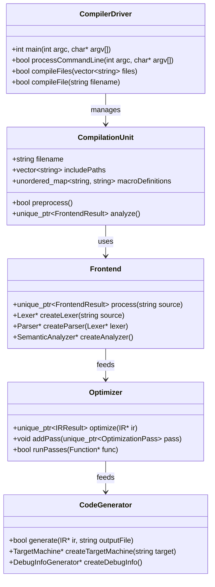
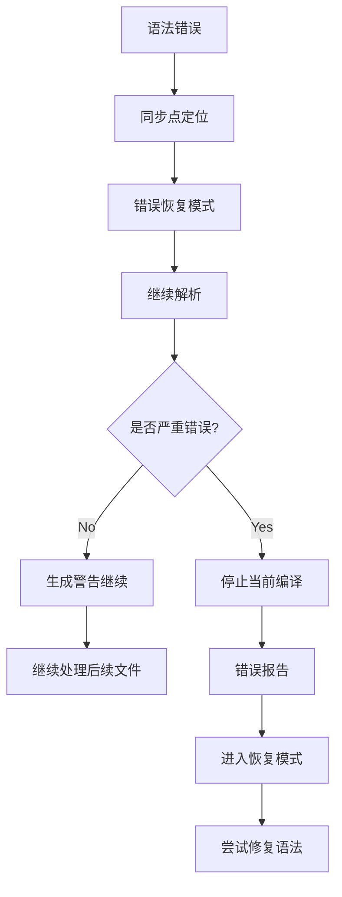
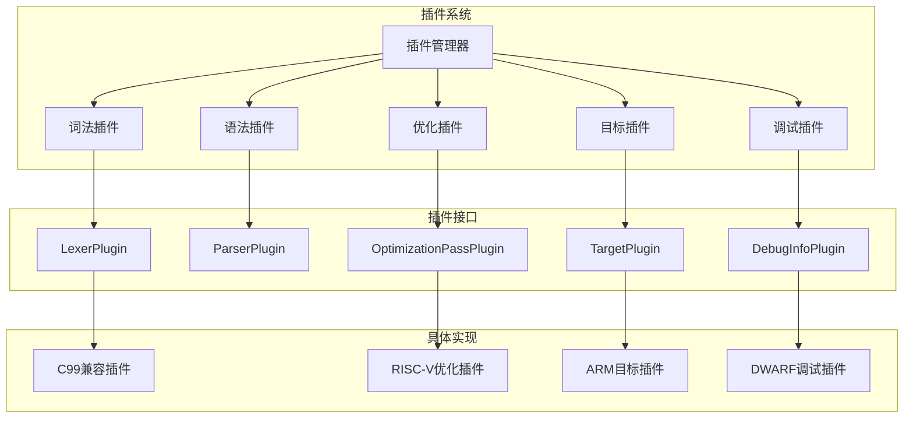

# 现代C语言编译器架构设计

## 目录
1. [项目概述](#项目概述)
2. [整体架构设计](#整体架构设计)
3. [项目目录结构](#项目目录结构)
4. [核心数据结构设计](#核心数据结构设计)
5. [模块接口设计](#模块接口设计)
6. [编译流水线](#编译流水线)
7. [现代特性支持](#现代特性支持)
8. [扩展性设计](#扩展性设计)

## 项目概述

### 设计目标
本项目旨在设计一个现代化的C语言编译器，支持C11/C17标准，具备以下核心特性：
- 高性能编译
- 模块化架构
- 跨平台支持
- 丰富的错误诊断
- 可扩展的优化框架
- 完整的调试信息生成

### 技术栈
- 目标语言：C99/C11/C17
- 实现语言：C++17
- 构建系统：CMake
- 测试框架：Google Test
- 文档系统：Sphinx/Doxygen

## 整体架构设计

### 编译器架构图



### 编译流水线

```mermaid
sequenceDiagram
    participant src as 源代码
    participant lexer as 词法分析器
    participant parser as 语法分析器
    participant ast as AST构建
    participant sem as 语义分析器
    participant ir as IR生成
    participant opt as 优化器
    participant gen as 代码生成器
    participant out as 目标代码
    
    src->>lexer: 字符流
    lexer->>parser: Token流
    parser->>ast: 构建AST
    ast->>sem: 类型检查
    sem->>ir: 生成IR
    ir->>opt: 优化IR
    opt->>gen: 生成目标代码
    gen->>out: 输出结果
```

## 项目目录结构

```
modern-c-compiler/
├── src/                          # 源代码目录
│   ├── frontend/                 # 前端模块
│   │   ├── lexer/               # 词法分析器
│   │   │   ├── lexer.h
│   │   │   ├── lexer.cpp
│   │   │   ├── token.h
│   │   │   └── tokenizer.cpp
│   │   ├── parser/              # 语法分析器
│   │   │   ├── parser.h
│   │   │   ├── parser.cpp
│   │   │   ├── grammar.h
│   │   │   └── error_recovery.cpp
│   │   ├── ast/                 # 抽象语法树
│   │   │   ├── ast.h
│   │   │   ├── ast_nodes.h
│   │   │   ├── ast_builder.cpp
│   │   │   └── ast_visitor.h
│   │   └── semanticanalyzer/     # 语义分析器
│   │       ├── semanticanalyzer.h
│   │       ├── typechecker.cpp
│   │       └── symboltable.cpp
│   ├── midend/                  # 中端模块
│   │   ├── ir/                  # 中间表示
│   │   │   ├── ir.h
│   │   │   ├── ir_builder.cpp
│   │   │   └── ir_instruction.h
│   │   └── optimizer/           # 优化器
│   │       ├── optimizer.h
│   │       ├── optimization_pass.h
│   │       ├── basic_block.cpp
│   │       ├── dataflow.cpp
│   │       └── passes/          # 优化passes
│   ├── backend/                 # 后端模块
│   │   ├── codegen/             # 代码生成器
│   │   │   ├── codegen.h
│   │   │   ├── target_machine.cpp
│   │   │   └── riscv/           # RISC-V后端
│   │   ├── registeralloc/       # 寄存器分配
│   │   │   ├── register_alloc.h
│   │   │   ├── liveness_analysis.cpp
│   │   │   └── graph_coloring.cpp
│   │   └── common/              # 后端公共代码
│   │       ├── instruction_selection.cpp
│   │       └── calling_convention.cpp
│   ├── common/                  # 公共组件
│   │   ├── utils/               # 工具函数
│   │   │   ├── string_utils.h
│   │   │   └── hash_table.h
│   │   ├── containers/          # 数据结构
│   │   │   ├── vector.h
│   │   │   ├── deque.h
│   │   │   └── bst.h
│   │   ├── io/                  # IO处理
│   │   │   ├── file_reader.h
│   │   │   └── output_writer.h
│   │   └── diagnostics/         # 诊断系统
│   │       ├── diagnostic_engine.h
│   │       ├── error_reporter.h
│   │       └── source_location.h
│   ├── type/                    # 类型系统
│   │   ├── types.h
│   │   ├── type_builder.cpp
│   │   ├── type_comparison.cpp
│   │   └── builtin_types.cpp
│   ├── symbol/                  # 符号表
│   │   ├── symbol_table.h
│   │   ├── symbol.h
│   │   ├── scope.h
│   │   └── name_lookup.cpp
│   ├── codegen/                 # 代码生成
│   │   ├── debug_info/          # 调试信息
│   │   │   ├── debug_info.h
│   │   │   ├── dwarf_generator.cpp
│   │   │   └── line_info.cpp
│   │   └── elf/                 # ELF文件生成
│   │       ├── elf_builder.cpp
│   │       └── section_manager.cpp
│   └── driver/                  # 编译器驱动
│       ├── compiler_driver.h
│       ├── command_line.cpp
│       └── compilation_unit.cpp
├── include/                     # 头文件目录
│   └── modern-c-compiler/
│       ├── public_api.h
│       └── version.h
├── test/                        # 测试目录
│   ├── unit/                    # 单元测试
│   ├── integration/             # 集成测试
│   ├── frontend/                # 前端测试
│   │   ├── lexer_tests.cpp
│   │   ├── parser_tests.cpp
│   │   └── ast_tests.cpp
│   ├── midend/                  # 中端测试
│   │   ├── ir_tests.cpp
│   │   └── optimizer_tests.cpp
│   ├── backend/                 # 后端测试
│   │   ├── codegen_tests.cpp
│   │   └── registeralloc_tests.cpp
│   └── fixtures/                # 测试用例
│       ├── valid_programs/
│       └── invalid_programs/
├── tools/                       # 工具目录
│   ├── cc                       # 编译器主程序
│   ├── cccheck                  # 静态分析工具
│   └── ccdump                   # AST/IR转储工具
├── build/                       # 构建目录
├── docs/                        # 文档目录
│   ├── architecture/            # 架构文档
│   ├── api/                     # API文档
│   ├── tutorials/               # 教程
│   └── doxygen/                 # Doxygen配置
├── examples/                    # 示例代码
│   ├── basic/                   # 基础示例
│   ├── intermediate/            # 中级示例
│   └── advanced/                # 高级示例
├── scripts/                     # 脚本目录
│   ├── build.sh
│   ├── test.sh
│   └── format.sh
├── CMakeLists.txt               # 根CMake文件
└── README.md
```

## 核心数据结构设计

### 抽象语法树(AST)节点设计

#### AST节点层次结构

```mermaid
classDiagram
    class ASTNode {
        +SourceLocation location
        +ASTNode* parent
        +virtual void accept(ASTVisitor& visitor)
        +virtual void dump(std::ostream& os) const
    }
    
    class Expression {
        +virtual Type* getType() const
        +virtual bool isLvalue() const
        +virtual bool isConstant() const
    }
    
    class Statement {
        +virtual bool isFallthrough() const
    }
    
    class Declaration {
        +virtual Symbol* getSymbol() const
    }
    
    class TypeSpecifier {
        +virtual Type* buildType() const
    }
    
    ASTNode <|-- Expression
    ASTNode <|-- Statement
    ASTNode <|-- Declaration
    ASTNode <|-- TypeSpecifier
    
    Expression <|-- Literal
    Expression <|-- BinaryOperator
    Expression <|-- UnaryOperator
    Expression <|-- FunctionCall
    Expression <|-- Identifier
    Expression <|-- MemberAccess
    Expression <|-- ArraySubscript
    
    Statement <|-- CompoundStatement
    Statement <|-- IfStatement
    Statement <|-- WhileStatement
    Statement <|-- ForStatement
    Statement <|-- ReturnStatement
    Statement <|-- ExpressionStatement
    Statement <|-- LabeledStatement
    Statement <|-- SwitchStatement
    Statement <|-- CaseStatement
    Statement <|-- BreakStatement
    Statement <|-- ContinueStatement
    Statement <|-- GotoStatement
    
    Declaration <|-- VariableDeclaration
    Declaration <|-- FunctionDeclaration
    Declaration <|-- StructDeclaration
    Declaration <|-- UnionDeclaration
    Declaration <|-- EnumDeclaration
    Declaration <|-- TypedefDeclaration
    
    TypeSpecifier <|-- BasicTypeSpecifier
    TypeSpecifier <|-- StructTypeSpecifier
    TypeSpecifier <|-- UnionTypeSpecifier
    TypeSpecifier <|-- EnumTypeSpecifier
    TypeSpecifier <|-- TypedefNameSpecifier
```



#### AST节点实现

```cpp
// ast.h
namespace ast {
    // 基础AST节点
    class ASTNode {
    public:
        SourceLocation location;
        ASTNode* parent = nullptr;
        
        virtual ~ASTNode() = default;
        virtual void accept(ASTVisitor& visitor) = 0;
        virtual void dump(std::ostream& os) const = 0;
    };
    
    // 表达式基类
    class Expression : public ASTNode {
    public:
        virtual ::type::Type* getType() const = 0;
        virtual bool isLvalue() const = 0;
        virtual bool isConstant() const = 0;
    };
    
    // 语句基类
    class Statement : public ASTNode {
    public:
        virtual bool isFallthrough() const = 0;
    };
    
    // 声明基类
    class Declaration : public ASTNode {
    public:
        virtual ::symbol::Symbol* getSymbol() const = 0;
    };
    
    // 复合语句
    class CompoundStatement : public Statement {
    public:
        std::vector<std::unique_ptr<Statement>> statements;
        std::vector<std::unique_ptr<Declaration>> declarations;
        
        void accept(ASTVisitor& visitor) override;
        void dump(std::ostream& os) const override;
        bool isFallthrough() const override { return true; }
    };
    
    // 二元运算符
    class BinaryOperator : public Expression {
    public:
        enum class Operator {
            Add, Sub, Mul, Div, Mod,    // 算术
            Eq, Ne, Lt, Le, Gt, Ge,     // 关系
            And, Or,                     // 逻辑
            Assign, AddAssign, SubAssign, // 赋值
            Comma,                       // 逗号
        };
        
        Operator op;
        std::unique_ptr<Expression> left;
        std::unique_ptr<Expression> right;
        
        void accept(ASTVisitor& visitor) override;
        void dump(std::ostream& os) const override;
        ::type::Type* getType() const override;
        bool isLvalue() const override;
        bool isConstant() const override;
    };
    
    // 变量声明
    class VariableDeclaration : public Declaration {
    public:
        std::unique_ptr<TypeSpecifier> type;
        std::string name;
        std::unique_ptr<Expression> initializer;
        bool isExtern = false;
        bool isStatic = false;
        bool isConst = false;
        
        void accept(ASTVisitor& visitor) override;
        void dump(std::ostream& os) const override;
        ::symbol::Symbol* getSymbol() const override;
    };
    
    // 函数声明
    class FunctionDeclaration : public Declaration {
    public:
        std::unique_ptr<TypeSpecifier> returnType;
        std::string name;
        std::vector<std::unique_ptr<VariableDeclaration>> parameters;
        std::unique_ptr<CompoundStatement> body;
        bool isExtern = false;
        bool isStatic = false;
        bool isInline = false;
        
        void accept(ASTVisitor& visitor) override;
        void dump(std::ostream& os) const override;
        ::symbol::Symbol* getSymbol() const override;
    };
}
```

### 符号表结构设计

#### 符号表层次结构



#### 符号表实现

```cpp
// symbol.h
namespace symbol {
    enum class SymbolKind {
        Variable,
        Function,
        Type,
        EnumConstant,
        Macro,
        Label,
    };
    
    class Symbol {
    public:
        std::string name;
        SymbolKind kind;
        ::type::Type* type = nullptr;
        SourceLocation location;
        bool isDefined = false;
        bool isExtern = false;
        bool isStatic = false;
        int storageSize = 0;
        int alignment = 0;
        void* value = nullptr;  // 用于常量值
        
        // 构造函数
        Symbol(const std::string& name, SymbolKind kind, SourceLocation loc)
            : name(name), kind(kind), location(loc) {}
        
        // 辅助方法
        bool isVariable() const { return kind == SymbolKind::Variable; }
        bool isFunction() const { return kind == SymbolKind::Function; }
        bool isType() const { return kind == SymbolKind::Type; }
    };
    
    class Scope {
    public:
        int level;
        Scope* parent = nullptr;
        std::unordered_map<std::string, std::unique_ptr<Symbol>> symbols;
        
        explicit Scope(int level, Scope* parent = nullptr)
            : level(level), parent(parent) {}
        
        void addSymbol(std::unique_ptr<Symbol> symbol);
        Symbol* lookup(const std::string& name);
        Symbol* lookupRecursive(const std::string& name);
        bool isGlobal() const { return parent == nullptr; }
    };
    
    class SymbolTable {
    private:
        std::vector<std::unique_ptr<Scope>> scopes;
        Scope* globalScope = nullptr;
        Scope* currentScope = nullptr;
        
    public:
        SymbolTable();
        
        // 作用域管理
        void enterScope();
        void exitScope();
        Scope* getCurrentScope() const { return currentScope; }
        Scope* getGlobalScope() const { return globalScope; }
        
        // 符号管理
        void addSymbol(std::unique_ptr<Symbol> symbol);
        Symbol* lookup(const std::string& name);
        Symbol* lookupInCurrentScope(const std::string& name);
        Symbol* lookupRecursive(const std::string& name);
        
        // 工具方法
        int getScopeLevel() const { return scopes.size() - 1; }
        bool isInGlobalScope() const { return currentScope == globalScope; }
    };
}
```

### 中间表示(IR)设计

#### IR指令层次结构



#### IR实现

```cpp
// ir.h
namespace ir {
    // 类型系统
    class Type {
    public:
        enum class Kind {
            Void, Int8, Int16, Int32, Int64,
            Float, Double, Pointer, Array, Function,
            Struct, Union
        };
        
        Kind kind;
        explicit Type(Kind kind) : kind(kind) {}
        virtual ~Type() = default;
        
        virtual bool isInteger() const;
        virtual bool isFloatingPoint() const;
        virtual bool isPointer() const;
        virtual bool isAggregate() const;
        virtual size_t getSize() const = 0;
        virtual void dump(std::ostream& os) const = 0;
    };
    
    // 基础值类
    class Value {
    public:
        Type* type;
        std::string name;
        int id = -1;  // 用于SSA形式
        
        explicit Value(Type* type, const std::string& name = "")
            : type(type), name(name) {}
        virtual ~Value() = default;
        
        virtual bool isConstant() const { return false; }
        virtual bool isInstruction() const { return false; }
        virtual bool isGlobal() const { return false; }
        virtual void dump(std::ostream& os) const = 0;
    };
    
    // 基本块
    class BasicBlock {
    public:
        std::string name;
        Function* parent = nullptr;
        std::vector<std::unique_ptr<Instruction>> instructions;
        std::vector<BasicBlock*> predecessors;
        std::vector<BasicBlock*> successors;
        
        explicit BasicBlock(const std::string& name);
        
        void addInstruction(std::unique_ptr<Instruction> inst);
        void addPredecessor(BasicBlock* pred);
        void addSuccessor(BasicBlock* succ);
        void dump(std::ostream& os) const;
        
        // CFG分析
        bool isEmpty() const { return instructions.empty(); }
        Instruction* getTerminator();
    };
    
    // 函数
    class Function {
    public:
        std::string name;
        Type* returnType;
        std::vector<Parameter> parameters;
        std::vector<std::unique_ptr<BasicBlock>> basicBlocks;
        symbol::SymbolTable symbolTable;
        bool isVariadic = false;
        bool hasVarArgs = false;
        
        explicit Function(Type* returnType, const std::string& name);
        
        void addParameter(Parameter param);
        void addBasicBlock(std::unique_ptr<BasicBlock> block);
        BasicBlock* createBasicBlock(const std::string& name);
        void dump(std::ostream& os) const;
    };
    
    // 模块
    class Module {
    public:
        std::string name;
        std::vector<std::unique_ptr<Function>> functions;
        std::vector<GlobalVariable> globals;
        symbol::SymbolTable globalSymbols;
        target::TargetMachine* targetMachine = nullptr;
        
        explicit Module(const std::string& name);
        
        void addFunction(std::unique_ptr<Function> func);
        void addGlobal(GlobalVariable global);
        Function* getFunction(const std::string& name);
        void dump(std::ostream& os) const;
    };
}
```

### 类型系统设计

#### 类型层次结构



## 模块接口设计

### 核心接口类图



### 主要接口定义

```cpp
// compiler_driver.h
class CompilerDriver {
public:
    struct Options {
        std::string outputFile = "a.out";
        std::string targetTriple;
        std::vector<std::string> includePaths;
        std::vector<std::string> macroDefinitions;
        bool optimize = false;
        bool debugInfo = false;
        bool generateIR = false;
        std::string optimizationLevel = "2";
        bool verbose = false;
        bool preprocessOnly = false;
    };
    
    int main(int argc, char* argv[]);
    
private:
    Options options;
    std::unique_ptr<diagnostic::DiagnosticEngine> diagnostics;
    std::unique_ptr<frontend::Frontend> frontend;
    std::unique_ptr<midend::Optimizer> optimizer;
    std::unique_ptr<backend::CodeGenerator> codegen;
    
    bool processCommandLine(int argc, char* argv[]);
    bool compileFile(const std::string& filename);
};

// frontend.h
namespace frontend {
    class Frontend {
    public:
        struct Result {
            std::unique_ptr<ast::ASTNode> ast;
            std::unique_ptr<symbol::SymbolTable> symbolTable;
            std::unique_ptr<ir::Module> ir;
            bool success = true;
            std::vector<std::string> errors;
        };
        
        Frontend(std::unique_ptr<diagnostic::DiagnosticEngine> diagnostics);
        
        std::unique_ptr<Result> process(const std::string& source, 
                                       const std::string& filename);
        
    private:
        std::unique_ptr<diagnostic::DiagnosticEngine> diagnostics_;
        std::unique_ptr<lexer::Lexer> lexer_;
        std::unique_ptr<parser::Parser> parser_;
        std::unique_ptr<semanticanalyzer::SemanticAnalyzer> analyzer_;
        std::unique_ptr<ir::IRGenerator> ir_generator_;
    };
}

// optimizer.h
namespace midend {
    class Optimizer {
    public:
        struct Result {
            std::unique_ptr<ir::Module> optimizedIR;
            std::unordered_map<std::string, int> passStatistics;
            bool success = true;
        };
        
        explicit Optimizer(std::unique_ptr<target::TargetMachine> target);
        
        std::unique_ptr<Result> optimize(std::unique_ptr<ir::Module> ir);
        void addPass(std::unique_ptr<OptimizationPass> pass);
        
    private:
        std::unique_ptr<target::TargetMachine> target_;
        std::vector<std::unique_ptr<OptimizationPass>> passes_;
        
        bool runFunctionPasses(ir::Function* func);
        bool runModulePasses(ir::Module* module);
    };
}

// code_generator.h
namespace backend {
    class CodeGenerator {
    public:
        struct Result {
            std::vector<uint8_t> binaryData;
            std::unique_ptr<debug::DebugInfo> debugInfo;
            bool success = true;
            std::string errorMessage;
        };
        
        CodeGenerator(std::unique_ptr<target::TargetMachine> target,
                     std::unique_ptr<debug::DebugInfoGenerator> debugGen);
        
        std::unique_ptr<Result> generate(std::unique_ptr<ir::Module> ir,
                                        const std::string& outputFile);
        
    private:
        std::unique_ptr<target::TargetMachine> target_;
        std::unique_ptr<debug::DebugInfoGenerator> debugGen_;
        std::unique_ptr<registeralloc::RegisterAllocator> regAlloc_;
    };
}
```

## 现代特性支持

### C11/C17标准支持

#### 核心语言特性
- `_Alignas` 和 `_Alignof` 关键字支持
- `_Atomic` 类型限定符和原子操作
- `_Generic` 泛型选择
- `_Static_assert` 静态断言
- 多线程支持 (`<threads.h>`)
- 边界检查函数 (`<stdckdint.h>`)

#### 类型系统增强
```cpp
// type_system.h
namespace type {
    class AtomicType : public Type {
    public:
        Type* atomicType;
        MemoryOrder memoryOrder;
        
        explicit AtomicType(Type* baseType)
            : atomicType(baseType) {}
    };
    
    class AlignedType : public Type {
    public:
        Type* baseType;
        size_t alignment;
        
        explicit AlignedType(Type* baseType, size_t align)
            : baseType(baseType), alignment(align) {}
    };
}

// 泛型选择支持
class GenericSelection : public Expression {
public:
    std::unique_ptr<Expression> controllingExpression;
    std::vector<GenericAssociation> associations;
    std::unique_ptr<Expression> defaultAssociation;
    
    void accept(ASTVisitor& visitor) override;
    ::type::Type* getType() const override;
};
```

### 错误恢复机制

#### 错误恢复策略


#### 错误处理实现
```cpp
// error_recovery.h
namespace error {
    class SyntaxErrorRecovery {
    public:
        enum class RecoveryMode {
            Panic,      // 恐慌模式，停止当前函数解析
            Phrase,     // 短语层恢复，跳过到下一个同步点
            Synchronization, // 同步恢复，基于同步集
            Heuristic   // 启发式恢复，尝试智能修复
        };
        
        SyntaxErrorRecovery(Parser* parser);
        
        bool handleError(const SourceLocation& loc, 
                        const std::string& message,
                        RecoveryMode mode = RecoveryMode::Synchronization);
        
        void addSynchronizationPoint(const std::vector<Token::Kind>& syncTokens);
        
    private:
        Parser* parser_;
        std::vector<std::vector<Token::Kind>> syncPoints_;
        size_t errorCount_ = 0;
        static constexpr size_t maxErrors_ = 20;
    };
    
    class ErrorCollector {
    public:
        void addError(SourceLocation loc, const std::string& message);
        void addWarning(SourceLocation loc, const std::string& message);
        void addNote(SourceLocation loc, const std::string& message);
        
        bool hasErrors() const { return !errors_.empty(); }
        size_t getErrorCount() const { return errors_.size(); }
        
        void dump(std::ostream& os) const;
        
    private:
        struct ErrorMessage {
            SourceLocation location;
            std::string message;
            std::string level; // "error", "warning", "note"
        };
        
        std::vector<ErrorMessage> errors_;
        std::vector<ErrorMessage> warnings_;
        std::vector<ErrorMessage> notes_;
    };
}
```

### 调试信息生成

#### DWARF调试信息
```cpp
// dwarf_generator.h
namespace debug {
    class DWARFGenerator {
    public:
        DWARFGenerator(std::ostream& output, 
                      const CompileUnit& compileUnit);
        
        void generateDebugInfo(const ir::Module* module);
        void generateLineInfo(const source::SourceManager& sourceMgr);
        void generateVariableInfo(const symbol::SymbolTable& symbols);
        
    private:
        std::ostream& output_;
        const CompileUnit& compileUnit_;
        
        void writeDIE(DIE* die);
        void writeAbbreviationTable();
        void writeLineNumberProgram();
    };
    
    class SourceLocationMapping {
    public:
        struct SourceMapping {
            uint32_t lowPC;
            uint32_t highPC;
            std::string file;
            uint32_t line;
            uint32_t column;
        };
        
        void addMapping(uint32_t pc, const SourceLocation& loc);
        SourceLocation getLocation(uint32_t pc) const;
        
    private:
        std::vector<SourceMapping> mappings_;
    };
}
```

## 扩展性设计

### 插件系统架构



### 优化Pass框架

```cpp
// optimization_pass.h
namespace optimization {
    class Pass {
    public:
        enum class Kind {
            ModulePass,
            FunctionPass,
            BasicBlockPass,
            InstructionPass
        };
        
        virtual ~Pass() = default;
        virtual Kind getKind() const = 0;
        virtual std::string getName() const = 0;
        virtual bool isRequired() const { return false; }
        virtual bool runOnModule(ir::Module& module) { return false; }
        virtual bool runOnFunction(ir::Function& func) { return false; }
        virtual bool runOnBasicBlock(ir::BasicBlock& block) { return false; }
    };
    
    class PassManager {
    public:
        template<typename PassType>
        void addPass() {
            static_assert(std::is_base_of<Pass, PassType>::value,
                         "PassType must derive from Pass");
            auto pass = std::make_unique<PassType>();
            passes_.push_back(std::move(pass));
        }
        
        bool run(ir::Module& module);
        
    private:
        std::vector<std::unique_ptr<Pass>> passes_;
    };
    
    // 具体优化Pass示例
    class ConstantFoldingPass : public Pass {
    public:
        Kind getKind() const override { return Kind::FunctionPass; }
        std::string getName() const override { return "Constant Folding"; }
        bool runOnFunction(ir::Function& func) override;
    };
    
    class DeadCodeEliminationPass : public Pass {
    public:
        Kind getKind() const override { return Kind::ModulePass; }
        std::string getName() const override { return "Dead Code Elimination"; }
        bool runOnModule(ir::Module& module) override;
    };
}
```

### 目标平台支持

```cpp
// target_machine.h
namespace target {
    class TargetMachine {
    public:
        virtual ~TargetMachine() = default;
        virtual std::string getTriple() const = 0;
        virtual void setTriple(const std::string& triple) = 0;
        
        // 寄存器信息
        virtual const RegisterInfo& getRegisterInfo() const = 0;
        virtual const InstructionInfo& getInstructionInfo() const = 0;
        
        // 调用约定
        virtual const CallingConvention& getCallingConvention() const = 0;
        
        // 数据布局
        virtual const DataLayout& getDataLayout() const = 0;
        
        // 代码生成
        virtual bool emitFunction(ir::Function& func, 
                                std::ostream& output) = 0;
        virtual bool emitModule(ir::Module& module, 
                              std::ostream& output) = 0;
    };
    
    // RISC-V目标机器
    class RISCVTargetMachine : public TargetMachine {
    public:
        RISCVTargetMachine(RISCVSubtarget subtarget);
        
        std::string getTriple() const override;
        const RegisterInfo& getRegisterInfo() const override;
        // ... 其他实现
    };
}
```

## 总结

本架构设计提供了一个完整的现代C语言编译器框架，具备以下特点：

1. **模块化设计**：清晰的模块分离，便于维护和扩展
2. **标准支持**：完整的C11/C17标准支持
3. **现代特性**：错误恢复、调试信息、跨平台支持
4. **可扩展性**：插件系统和优化框架
5. **高性能**：优化的IR和代码生成
6. **可维护性**：清晰的接口和数据结构设计

这个架构为后续的具体实现提供了坚实的蓝图，确保编译器既能满足现代C语言开发的需求，又具备良好的可扩展性和维护性。