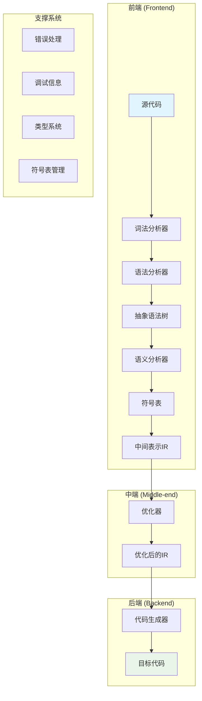
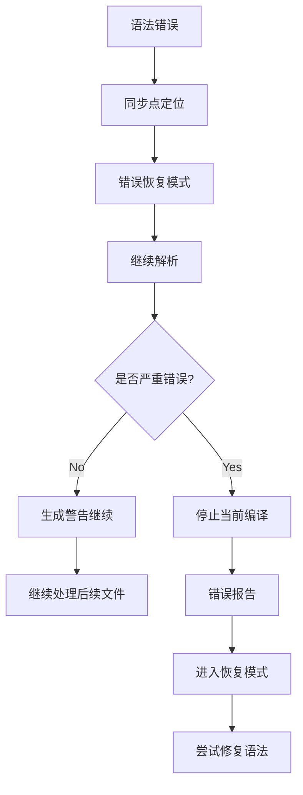
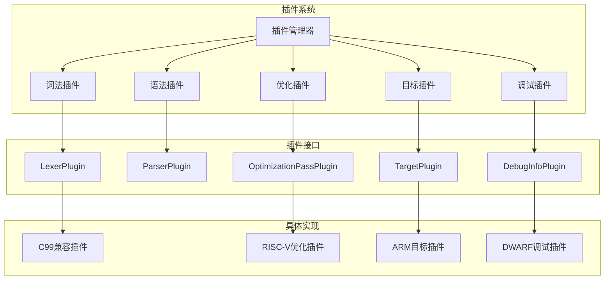

# 现代C语言编译器架构设计

## 目录
1. [项目概述](#项目概述)
2. [整体架构设计](#整体架构设计)
3. [项目目录结构](#项目目录结构)
4. [核心数据结构设计](#核心数据结构设计)
5. [模块接口设计](#模块接口设计)
6. [编译流水线](#编译流水线)
7. [现代特性支持](#现代特性支持)
8. [扩展性设计](#扩展性设计)

## 项目概述

### 设计目标
本项目旨在设计一个现代化的C语言编译器，支持C11/C17标准，具备以下核心特性：
- 高性能编译
- 模块化架构
- 跨平台支持
- 丰富的错误诊断
- 可扩展的优化框架
- 完整的调试信息生成

### 技术栈
- 目标语言：C99/C11/C17
- 实现语言：纯C语言（C99/C11标准）
- 构建系统：CMake
- 测试框架：自定义C语言测试框架
- 文档系统：Sphinx/Doxygen

## 整体架构设计

### 编译器架构图



### 编译流水线

```mermaid
sequenceDiagram
    participant src as 源代码
    participant lexer as 词法分析器
    participant parser as 语法分析器
    participant ast as AST构建
    participant sem as 语义分析器
    participant ir as IR生成
    participant opt as 优化器
    participant gen as 代码生成器
    participant out as 目标代码
    
    src->>lexer: 字符流
    lexer->>parser: Token流
    parser->>ast: 构建AST
    ast->>sem: 类型检查
    sem->>ir: 生成IR
    ir->>opt: 优化IR
    opt->>gen: 生成目标代码
    gen->>out: 输出结果
```

## 项目目录结构

```
modern-c-compiler/
├── src/                          # 源代码目录
│   ├── frontend/                 # 前端模块
│   │   ├── lexer/               # 词法分析器
│   │   │   ├── lexer.h
│   │   │   ├── lexer.c
│   │   │   ├── token.h
│   │   │   └── tokenizer.c
│   │   ├── parser/              # 语法分析器
│   │   │   ├── parser.h
│   │   │   ├── parser.c
│   │   │   ├── grammar.h
│   │   │   └── error_recovery.c
│   │   ├── ast/                 # 抽象语法树
│   │   │   ├── ast.h
│   │   │   ├── ast_nodes.h
│   │   │   ├── ast_builder.c
│   │   │   └── ast_visitor.h
│   │   └── semanticanalyzer/     # 语义分析器
│   │       ├── semanticanalyzer.h
│   │       ├── typechecker.cpp
│   │       └── symboltable.cpp
│   ├── midend/                  # 中端模块
│   │   ├── ir/                  # 中间表示
│   │   │   ├── ir.h
│   │   │   ├── ir_builder.c
│   │   │   └── ir_instruction.h
│   │   └── optimizer/           # 优化器
│   │       ├── optimizer.h
│   │       ├── optimization_pass.h
│   │       ├── basic_block.cpp
│   │       ├── dataflow.cpp
│   │       └── passes/          # 优化passes
│   ├── backend/                 # 后端模块
│   │   ├── codegen/             # 代码生成器
│   │   │   ├── codegen.h
│   │   │   ├── target_machine.c
│   │   │   └── riscv/           # RISC-V后端
│   │   ├── registeralloc/       # 寄存器分配
│   │   │   ├── register_alloc.h
│   │   │   ├── liveness_analysis.c
│   │   │   └── graph_coloring.c
│   │   └── common/              # 后端公共代码
│   │       ├── instruction_selection.cpp
│   │       └── calling_convention.cpp
│   ├── common/                  # 公共组件
│   │   ├── utils/               # 工具函数
│   │   │   ├── string_utils.h
│   │   │   └── hash_table.h
│   │   ├── containers/          # 数据结构
│   │   │   ├── vector.h
│   │   │   ├── deque.h
│   │   │   └── bst.h
│   │   ├── io/                  # IO处理
│   │   │   ├── file_reader.h
│   │   │   └── output_writer.h
│   │   └── diagnostics/         # 诊断系统
│   │       ├── diagnostic_engine.h
│   │       ├── error_reporter.h
│   │       └── source_location.h
│   ├── type/                    # 类型系统
│   │   ├── types.h
│   │   ├── type_builder.c
│   │   ├── type_comparison.c
│   │   └── builtin_types.c
│   ├── symbol/                  # 符号表
│   │   ├── symbol_table.h
│   │   ├── symbol.h
│   │   ├── scope.h
│   │   └── name_lookup.c
│   ├── codegen/                 # 代码生成
│   │   ├── debug_info/          # 调试信息
│   │   │   ├── debug_info.h
│   │   │   ├── dwarf_generator.c
│   │   │   └── line_info.c
│   │   └── elf/                 # ELF文件生成
│   │       ├── elf_builder.cpp
│   │       └── section_manager.cpp
│   └── driver/                  # 编译器驱动
│       ├── compiler_driver.h
│       ├── command_line.cpp
│       └── compilation_unit.cpp
├── include/                     # 头文件目录
│   └── modern-c-compiler/
│       ├── public_api.h
│       └── version.h
├── test/                        # 测试目录
│   ├── unit/                    # 单元测试
│   ├── integration/             # 集成测试
│   ├── frontend/                # 前端测试
│   │   ├── lexer_tests.cpp
│   │   ├── parser_tests.cpp
│   │   └── ast_tests.cpp
│   ├── midend/                  # 中端测试
│   │   ├── ir_tests.cpp
│   │   └── optimizer_tests.cpp
│   ├── backend/                 # 后端测试
│   │   ├── codegen_tests.cpp
│   │   └── registeralloc_tests.cpp
│   └── fixtures/                # 测试用例
│       ├── valid_programs/
│       └── invalid_programs/
├── tools/                       # 工具目录
│   ├── cc                       # 编译器主程序
│   ├── cccheck                  # 静态分析工具
│   └── ccdump                   # AST/IR转储工具
├── build/                       # 构建目录
├── docs/                        # 文档目录
│   ├── architecture/            # 架构文档
│   ├── api/                     # API文档
│   ├── tutorials/               # 教程
│   └── doxygen/                 # Doxygen配置
├── examples/                    # 示例代码
│   ├── basic/                   # 基础示例
│   ├── intermediate/            # 中级示例
│   └── advanced/                # 高级示例
├── scripts/                     # 脚本目录
│   ├── build.sh
│   ├── test.sh
│   └── format.sh
├── CMakeLists.txt               # 根CMake文件
└── README.md
```

## 核心数据结构设计

### 抽象语法树(AST)节点设计

#### AST节点层次结构

```mermaid
classDiagram
    struct ASTNode {
        +SourceLocation location
        +ASTNode* parent
        +void (*accept)(ASTNode* self, ASTVisitor* visitor)
        +void (*dump)(const ASTNode* self, FILE* os)
    }
    
    struct Expression {
        +Type* (*getType)(const Expression* self)
        +bool (*isLvalue)(const Expression* self)
        +bool (*isConstant)(const Expression* self)
    }
    
    struct Statement {
        +bool (*isFallthrough)(const Statement* self)
    }
    
    struct Declaration {
        +Symbol* (*getSymbol)(const Declaration* self)
    }
    
    struct TypeSpecifier {
        +Type* (*buildType)(const TypeSpecifier* self)
    }
    
    ASTNode <|-- Expression
    ASTNode <|-- Statement
    ASTNode <|-- Declaration
    ASTNode <|-- TypeSpecifier
    
    Expression <|-- Literal
    Expression <|-- BinaryOperator
    Expression <|-- UnaryOperator
    Expression <|-- FunctionCall
    Expression <|-- Identifier
    Expression <|-- MemberAccess
    Expression <|-- ArraySubscript
    
    Statement <|-- CompoundStatement
    Statement <|-- IfStatement
    Statement <|-- WhileStatement
    Statement <|-- ForStatement
    Statement <|-- ReturnStatement
    Statement <|-- ExpressionStatement
    Statement <|-- LabeledStatement
    Statement <|-- SwitchStatement
    Statement <|-- CaseStatement
    Statement <|-- BreakStatement
    Statement <|-- ContinueStatement
    Statement <|-- GotoStatement
    
    Declaration <|-- VariableDeclaration
    Declaration <|-- FunctionDeclaration
    Declaration <|-- StructDeclaration
    Declaration <|-- UnionDeclaration
    Declaration <|-- EnumDeclaration
    Declaration <|-- TypedefDeclaration
    
    TypeSpecifier <|-- BasicTypeSpecifier
    TypeSpecifier <|-- StructTypeSpecifier
    TypeSpecifier <|-- UnionTypeSpecifier
    TypeSpecifier <|-- EnumTypeSpecifier
    TypeSpecifier <|-- TypedefNameSpecifier
```

#### AST节点实现

```c
// ast.h
#ifndef AST_H
#define AST_H

#include <stdbool.h>
#include <stddef.h>

// 前向声明
typedef struct Type Type;
typedef struct Symbol Symbol;
typedef struct ASTVisitor ASTVisitor;

// AST节点类型枚举
typedef enum {
    AST_NODE_EXPRESSION,
    AST_NODE_STATEMENT,
    AST_NODE_DECLARATION,
    AST_NODE_TYPE_SPECIFIER
} ASTNodeType;

// 基础AST节点结构
typedef struct ASTNode {
    SourceLocation location;
    struct ASTNode* parent;
    ASTNodeType type;
    
    // 虚函数表（函数指针）
    void (*accept)(struct ASTNode* self, ASTVisitor* visitor);
    void (*dump)(const struct ASTNode* self, FILE* os);
    void (*destroy)(struct ASTNode* self);
} ASTNode;

// 表达式结构体
typedef struct Expression {
    ASTNode base;
    
    // 表达式函数指针
    Type* (*getType)(const struct Expression* self);
    bool (*isLvalue)(const struct Expression* self);
    bool (*isConstant)(const struct Expression* self);
} Expression;

// 语句结构体
typedef struct Statement {
    ASTNode base;
    
    // 语句函数指针
    bool (*isFallthrough)(const struct Statement* self);
} Statement;

// 声明结构体
typedef struct Declaration {
    ASTNode base;
    
    // 声明函数指针
    Symbol* (*getSymbol)(const struct Declaration* self);
} Declaration;

// 复合语句
typedef struct CompoundStatement {
    Statement base;
    
    // 动态数组存储语句和声明
    struct Vector* statements;    // Statement*
    struct Vector* declarations;  // Declaration*
} CompoundStatement;

// 二元运算符
typedef enum {
    BINOP_ADD, BINOP_SUB, BINOP_MUL, BINOP_DIV, BINOP_MOD,    // 算术
    BINOP_EQ, BINOP_NE, BINOP_LT, BINOP_LE, BINOP_GT, BINOP_GE, // 关系
    BINOP_AND, BINOP_OR,                                     // 逻辑
    BINOP_ASSIGN, BINOP_ADD_ASSIGN, BINOP_SUB_ASSIGN,         // 赋值
    BINOP_COMMA                                              // 逗号
} BinaryOperator;

typedef struct BinaryOperatorExpr {
    Expression base;
    BinaryOperator op;
    Expression* left;
    Expression* right;
} BinaryOperatorExpr;

// 变量声明
typedef struct VariableDeclaration {
    Declaration base;
    TypeSpecifier* type;
    char* name;
    Expression* initializer;
    bool isExtern;
    bool isStatic;
    bool isConst;
} VariableDeclaration;

// 函数声明
typedef struct FunctionDeclaration {
    Declaration base;
    TypeSpecifier* returnType;
    char* name;
    struct Vector* parameters;  // VariableDeclaration*
    CompoundStatement* body;
    bool isExtern;
    bool isStatic;
    bool isInline;
} FunctionDeclaration;

// 构造函数
ASTNode* createCompoundStatement(void);
ASTNode* createBinaryOperator(BinaryOperator op, Expression* left, Expression* right);
ASTNode* createVariableDeclaration(const char* name, TypeSpecifier* type);
ASTNode* createFunctionDeclaration(const char* name, TypeSpecifier* returnType);

#endif // AST_H
```

### 符号表结构设计

#### 符号表层次结构

```mermaid
classDiagram
    struct Symbol {
        +Variable
        +Function
        +Type
        +EnumConstant
        +Macro
    }
    
    struct Scope {
        +int level
        +Scope* parent
        +HashTable* symbols
        +void (*addSymbol)(Scope* self, const char* name, Symbol* symbol)
        +Symbol* (*lookup)(const Scope* self, const char* name)
        +Symbol* (*lookupRecursive)(const Scope* self, const char* name)
    }
    
    struct SymbolTable {
        +Vector* scopes
        +Scope* globalScope
        +Scope* currentScope
        +void (*enterScope)(SymbolTable* self)
        +void (*exitScope)(SymbolTable* self)
        +void (*addSymbol)(SymbolTable* self, const char* name, Symbol* symbol)
        +Symbol* (*lookup)(const SymbolTable* self, const char* name)
    }
    
    struct Symbol {
        +char* name
        +SymbolKind kind
        +Type* type
        +SourceLocation location
        +bool isDefined
        +bool isExtern
        +bool isStatic
        +int storageSize
        +int alignment
        +void* value  // 用于常量
    }
    
    Scope --> Symbol : contains
    SymbolTable --> Scope : manages
```

#### 符号表实现

```c
// symbol.h
#ifndef SYMBOL_H
#define SYMBOL_H

#include <stdbool.h>
#include <stddef.h>

// 前向声明
typedef struct Type Type;
typedef struct Symbol Symbol;
typedef struct Scope Scope;
typedef struct SymbolTable SymbolTable;

// 符号类型枚举
typedef enum {
    SYMBOL_VARIABLE,
    SYMBOL_FUNCTION,
    SYMBOL_TYPE,
    SYMBOL_ENUM_CONSTANT,
    SYMBOL_MACRO,
    SYMBOL_LABEL
} SymbolKind;

// 符号结构
struct Symbol {
    char* name;
    SymbolKind kind;
    Type* type;
    SourceLocation location;
    bool isDefined;
    bool isExtern;
    bool isStatic;
    int storageSize;
    int alignment;
    void* value;  // 用于常量值
    
    // 引用计数用于内存管理
    int refCount;
};

// 符号表条目（用于哈希表）
typedef struct SymbolEntry {
    char* key;
    Symbol* symbol;
    struct SymbolEntry* next;  // 链表解决冲突
} SymbolEntry;

// 作用域结构
struct Scope {
    int level;
    Scope* parent;
    SymbolEntry** symbolTable;  // 哈希表
    size_t tableSize;
    size_t symbolCount;
};

// 符号表结构
struct SymbolTable {
    struct Vector* scopes;  // Scope*
    Scope* globalScope;
    Scope* currentScope;
    
    // 内存池管理
    struct MemoryPool* symbolPool;
    struct MemoryPool* scopePool;
};

// 构造函数和析构函数
SymbolTable* createSymbolTable(void);
void destroySymbolTable(SymbolTable* table);

// 作用域管理
void symbolTableEnterScope(SymbolTable* table);
void symbolTableExitScope(SymbolTable* table);
Scope* symbolTableGetCurrentScope(const SymbolTable* table);
Scope* symbolTableGetGlobalScope(const SymbolTable* table);

// 符号管理
bool symbolTableAddSymbol(SymbolTable* table, Symbol* symbol);
Symbol* symbolTableLookup(const SymbolTable* table, const char* name);
Symbol* symbolTableLookupInCurrentScope(const SymbolTable* table, const char* name);
Symbol* symbolTableLookupRecursive(const SymbolTable* table, const char* name);

// 符号构造函数
Symbol* createSymbol(const char* name, SymbolKind kind, SourceLocation location);
void destroySymbol(Symbol* symbol);

// 符号辅助方法
bool symbolIsVariable(const Symbol* symbol);
bool symbolIsFunction(const Symbol* symbol);
bool symbolIsType(const Symbol* symbol);

// 工具方法
int symbolTableGetScopeLevel(const SymbolTable* table);
bool symbolTableIsInGlobalScope(const SymbolTable* table);

#endif // SYMBOL_H
```

### 中间表示(IR)设计

#### IR指令层次结构

```mermaid
classDiagram
    struct Value {
        +Type* type
        +bool (*isConstant)(const Value* self)
        +bool (*isInstruction)(const Value* self)
        +void (*dump)(const Value* self, FILE* os)
    }
    
    struct Instruction {
        +int id
        +BasicBlock* parent
        +Vector* operands
        +bool (*isTerminator)(const Instruction* self)
        +bool (*hasSideEffects)(const Instruction* self)
    }
    
    struct BasicBlock {
        +char* name
        +Function* parent
        +Vector* instructions
        +Vector* predecessors
        +Vector* successors
        +void (*addInstruction)(BasicBlock* self, Instruction* inst)
    }
    
    struct Function {
        +char* name
        +Type* returnType
        +Vector* parameters
        +Vector* basicBlocks
        +SymbolTable localSymbols
        +void (*addBasicBlock)(Function* self, BasicBlock* block)
    }
    
    struct Module {
        +char* name
        +Vector* functions
        +Vector* globals
        +SymbolTable globalSymbols
        +void (*addFunction)(Module* self, Function* func)
    }
    
    Value <|-- Instruction
    Value <|-- Constant
    Value <|-- GlobalVariable
    Value <|-- LocalVariable
    
    Instruction <|-- BinaryInstruction
    Instruction <|-- UnaryInstruction
    Instruction <|-- LoadInstruction
    Instruction <|-- StoreInstruction
    Instruction <|-- AllocaInstruction
    Instruction <|-- CallInstruction
    Instruction <|-- BranchInstruction
    Instruction <|-- ReturnInstruction
    Instruction <|-- PhiInstruction
    Instruction <|-- GetElementPtrInstruction
```

#### IR实现

```c
// ir.h
#ifndef IR_H
#define IR_H

#include <stdbool.h>
#include <stddef.h>

// 前向声明
typedef struct Type Type;
typedef struct Value Value;
typedef struct Instruction Instruction;
typedef struct BasicBlock BasicBlock;
typedef struct Function Function;
typedef struct Module Module;
typedef struct SymbolTable SymbolTable;

// IR类型系统
typedef enum {
    TYPE_VOID, TYPE_INT8, TYPE_INT16, TYPE_INT32, TYPE_INT64,
    TYPE_FLOAT, TYPE_DOUBLE, TYPE_POINTER, TYPE_ARRAY, TYPE_FUNCTION,
    TYPE_STRUCT, TYPE_UNION
} TypeKind;

// 类型结构
struct Type {
    TypeKind kind;
    
    // 函数指针表
    bool (*isInteger)(const Type* self);
    bool (*isFloatingPoint)(const Type* self);
    bool (*isPointer)(const Type* self);
    bool (*isAggregate)(const Type* self);
    size_t (*getSize)(const Type* self);
    void (*dump)(const Type* self, FILE* os);
    
    // 类型特定数据
    union {
        struct {
            Type* elementType;
            size_t size;
        } arrayInfo;
        
        struct {
            Type* returnType;
            struct Vector* parameterTypes;  // Type*
            bool isVariadic;
        } functionInfo;
        
        struct {
            char* name;
            struct Vector* fields;  // StructField*
        } structInfo;
    } data;
};

// 基础值结构体
struct Value {
    Type* type;
    char* name;
    int id;  // 用于SSA形式
    
    // 函数指针表
    bool (*isConstant)(const Value* self);
    bool (*isInstruction)(const Value* self);
    bool (*isGlobal)(const Value* self);
    void (*dump)(const Value* self, FILE* os);
    
    // 引用计数
    int refCount;
};

// 基本块
struct BasicBlock {
    char* name;
    Function* parent;
    struct Vector* instructions;  // Instruction*
    struct Vector* predecessors;   // BasicBlock*
    struct Vector* successors;    // BasicBlock*
    
    // 内存管理
    struct MemoryPool* instructionPool;
};

// 函数参数
typedef struct {
    char* name;
    Type* type;
} Parameter;

// 函数
struct Function {
    char* name;
    Type* returnType;
    struct Vector* parameters;  // Parameter*
    struct Vector* basicBlocks; // BasicBlock*
    SymbolTable* symbolTable;
    bool isVariadic;
    bool hasVarArgs;
    
    // 内存管理
    struct MemoryPool* basicBlockPool;
};

// 全局变量
typedef struct {
    char* name;
    Type* type;
    void* initialValue;
    bool isExtern;
    bool isConstant;
} GlobalVariable;

// 模块
struct Module {
    char* name;
    struct Vector* functions;  // Function*
    struct Vector* globals;    // GlobalVariable*
    SymbolTable* globalSymbols;
    struct TargetMachine* targetMachine;
    
    // 内存管理
    struct MemoryPool* functionPool;
    struct MemoryPool* globalPool;
};

// 构造函数和析构函数
Module* createModule(const char* name);
void destroyModule(Module* module);
Function* createFunction(Type* returnType, const char* name);
void destroyFunction(Function* function);
BasicBlock* createBasicBlock(const char* name);
void destroyBasicBlock(BasicBlock* block);

// 基本块操作
void basicBlockAddInstruction(BasicBlock* block, Instruction* inst);
void basicBlockAddPredecessor(BasicBlock* block, BasicBlock* pred);
void basicBlockAddSuccessor(BasicBlock* block, BasicBlock* succ);
void basicBlockDump(const BasicBlock* block, FILE* os);
bool basicBlockIsEmpty(const BasicBlock* block);
Instruction* basicBlockGetTerminator(const BasicBlock* block);

// 函数操作
void functionAddParameter(Function* func, Parameter param);
void functionAddBasicBlock(Function* func, BasicBlock* block);
BasicBlock* functionCreateBasicBlock(Function* func, const char* name);
void functionDump(const Function* func, FILE* os);

// 模块操作
void moduleAddFunction(Module* module, Function* func);
void moduleAddGlobal(Module* module, GlobalVariable global);
Function* moduleGetFunction(const Module* module, const char* name);
void moduleDump(const Module* module, FILE* os);

#endif // IR_H
```

### 类型系统设计

#### 类型层次结构

```mermaid
classDiagram
    struct Type {
        +TypeKind kind
        +size_t (*getSize)(const Type* self)
        +size_t (*getAlignment)(const Type* self)
        +bool (*isComplete)(const Type* self)
        +void (*dump)(const Type* self, FILE* os)
        +bool (*equals)(const Type* self, Type* other)
    }
    
    struct PrimitiveType {
        +bool isConst
        +bool isVolatile
    }
    
    struct AggregateType {
        +Vector* members
        +bool isComplete
    }
    
    struct PointerType {
        +Type* pointeeType
    }
    
    struct ArrayType {
        +Type* elementType
        +size_t size  // 0表示变长数组
    }
    
    struct FunctionType {
        +Type* returnType
        +Vector* parameterTypes
        +bool isVariadic
    }
    
    struct StructType {
        +char* name
        +Vector* fields
        +Vector* offsets
    }
    
    struct UnionType {
        +char* name
        +Vector* fields
    }
    
    struct EnumType {
        +char* name
        +PrimitiveType* underlyingType
        +Vector* constants
    }
    
    Type <|-- PrimitiveType
    Type <|-- PointerType
    Type <|-- ArrayType
    Type <|-- FunctionType
    Type <|-- AggregateType
    AggregateType <|-- StructType
    AggregateType <|-- UnionType
    Type <|-- EnumType
```

## 模块接口设计

### 核心接口类图

```mermaid
classDiagram
    struct CompilerDriver {
        +int (*main)(int argc, char* argv[])
        +bool (*processCommandLine)(CompilerDriver* driver, int argc, char* argv[])
        +bool (*compileFiles)(CompilerDriver* driver, struct Vector* files)
        +bool (*compileFile)(CompilerDriver* driver, const char* filename)
    }
    
    struct CompilationUnit {
        +char* filename
        +Vector* includePaths
        +HashTable* macroDefinitions
        +bool (*preprocess)(CompilationUnit* self)
        +FrontendResult* (*analyze)(CompilationUnit* self)
    }
    
    struct Frontend {
        +FrontendResult* (*process)(Frontend* self, const char* source)
        +struct Lexer* (*createLexer)(Frontend* self, const char* source)
        +struct Parser* (*createParser)(Frontend* self, struct Lexer* lexer)
        +struct SemanticAnalyzer* (*createAnalyzer)(Frontend* self)
    }
    
    struct Optimizer {
        +OptimizerResult* (*optimize)(Optimizer* self, Module* ir)
        +void (*addPass)(Optimizer* self, OptimizationPass* pass)
        +bool (*runPasses)(Optimizer* self, Function* func)
    }
    
    struct CodeGenerator {
        +bool (*generate)(CodeGenerator* self, Module* ir, const char* outputFile)
        +TargetMachine* (*createTargetMachine)(CodeGenerator* self, const char* target)
        +DebugInfoGenerator* (*createDebugInfo)(CodeGenerator* self)
    }
    
    CompilerDriver --> CompilationUnit : manages
    CompilationUnit --> Frontend : uses
    Frontend --> Optimizer : feeds
    Optimizer --> CodeGenerator : feeds
```

### 主要接口定义

```c
// compiler_driver.h
#ifndef COMPILER_DRIVER_H
#define COMPILER_DRIVER_H

#include <stdbool.h>
#include <stddef.h>

// 前向声明
typedef struct DiagnosticEngine DiagnosticEngine;
typedef struct Frontend Frontend;
typedef struct Optimizer Optimizer;
typedef struct CodeGenerator CodeGenerator;
typedef struct TargetMachine TargetMachine;

// 编译器选项
typedef struct {
    char* outputFile;
    char* targetTriple;
    struct Vector* includePaths;     // char*
    struct Vector* macroDefinitions;  // char*
    bool optimize;
    bool debugInfo;
    bool generateIR;
    char* optimizationLevel;
    bool verbose;
    bool preprocessOnly;
} CompilerOptions;

// 编译器驱动
typedef struct {
    CompilerOptions options;
    DiagnosticEngine* diagnostics;
    Frontend* frontend;
    Optimizer* optimizer;
    CodeGenerator* codegen;
} CompilerDriver;

// 构造函数和析构函数
CompilerDriver* createCompilerDriver(void);
void destroyCompilerDriver(CompilerDriver* driver);

// 主要接口
int compilerDriverMain(CompilerDriver* driver, int argc, char* argv[]);
bool compilerDriverProcessCommandLine(CompilerDriver* driver, int argc, char* argv[]);
bool compilerDriverCompileFile(CompilerDriver* driver, const char* filename);

#endif // COMPILER_DRIVER_H

// frontend.h
#ifndef FRONTEND_H
#define FRONTEND_H

#include <stdbool.h>
#include <stddef.h>

// 前向声明
typedef struct ASTNode ASTNode;
typedef struct SymbolTable SymbolTable;
typedef struct Module Module;
typedef struct DiagnosticEngine DiagnosticEngine;

// 前端结果
typedef struct {
    ASTNode* ast;
    SymbolTable* symbolTable;
    Module* ir;
    bool success;
    struct Vector* errors;  // char*
} FrontendResult;

// 前端接口
typedef struct {
    DiagnosticEngine* diagnostics;
    
    // 私有实现数据
    struct Lexer* lexer;
    struct Parser* parser;
    struct SemanticAnalyzer* analyzer;
    struct IRGenerator* irGenerator;
} Frontend;

// 构造函数和析构函数
Frontend* createFrontend(DiagnosticEngine* diagnostics);
void destroyFrontend(Frontend* frontend);

// 主要接口
FrontendResult* frontendProcess(Frontend* frontend,
                               const char* source,
                               const char* filename);
void destroyFrontendResult(FrontendResult* result);

#endif // FRONTEND_H

// optimizer.h
#ifndef OPTIMIZER_H
#define OPTIMIZER_H

#include <stdbool.h>
#include <stddef.h>

// 前向声明
typedef struct Module Module;
typedef struct Function Function;
typedef struct TargetMachine TargetMachine;
typedef struct OptimizationPass OptimizationPass;

// 优化器结果
typedef struct {
    Module* optimizedIR;
    struct HashTable* passStatistics;  // char* -> int
    bool success;
} OptimizerResult;

// 优化器接口
typedef struct {
    TargetMachine* target;
    struct Vector* passes;  // OptimizationPass*
    
    // 私有数据
    void* privateData;
} Optimizer;

// 构造函数和析构函数
Optimizer* createOptimizer(TargetMachine* target);
void destroyOptimizer(Optimizer* optimizer);

// 主要接口
OptimizerResult* optimizerOptimize(Optimizer* optimizer, Module* ir);
bool optimizerAddPass(Optimizer* optimizer, OptimizationPass* pass);
void destroyOptimizerResult(OptimizerResult* result);

// 私有方法
bool optimizerRunFunctionPasses(Optimizer* optimizer, Function* func);
bool optimizerRunModulePasses(Optimizer* optimizer, Module* module);

#endif // OPTIMIZER_H

// code_generator.h
#ifndef CODE_GENERATOR_H
#define CODE_GENERATOR_H

#include <stdbool.h>
#include <stddef.h>

// 前向声明
typedef struct Module Module;
typedef struct TargetMachine TargetMachine;
typedef struct DebugInfoGenerator DebugInfoGenerator;
typedef struct RegisterAllocator RegisterAllocator;
typedef struct DebugInfo DebugInfo;

// 代码生成结果
typedef struct {
    struct Vector* binaryData;  // uint8_t*
    DebugInfo* debugInfo;
    bool success;
    char* errorMessage;
} CodeGenResult;

// 代码生成器接口
typedef struct {
    TargetMachine* target;
    DebugInfoGenerator* debugGen;
    RegisterAllocator* regAlloc;
    
    // 私有数据
    void* privateData;
} CodeGenerator;

// 构造函数和析构函数
CodeGenerator* createCodeGenerator(TargetMachine* target,
                                DebugInfoGenerator* debugGen);
void destroyCodeGenerator(CodeGenerator* codegen);

// 主要接口
CodeGenResult* codeGeneratorGenerate(CodeGenerator* codegen,
                                  Module* ir,
                                  const char* outputFile);
void destroyCodeGenResult(CodeGenResult* result);

#endif // CODE_GENERATOR_H
```

## 现代特性支持

### C11/C17标准支持

#### 核心语言特性
- `_Alignas` 和 `_Alignof` 关键字支持
- `_Atomic` 类型限定符和原子操作
- `_Generic` 泛型选择
- `_Static_assert` 静态断言
- 多线程支持 (`<threads.h>`)
- 边界检查函数 (`<stdckdint.h>`)

#### 类型系统增强
```c
// type_system.h
#ifndef TYPE_SYSTEM_H
#define TYPE_SYSTEM_H

#include <stddef.h>

// 前向声明
typedef struct Type Type;
typedef struct Expression Expression;

// 内存顺序枚举（C11原子操作）
typedef enum {
    MEMORY_ORDER_RELAXED,
    MEMORY_ORDER_CONSUME,
    MEMORY_ORDER_ACQUIRE,
    MEMORY_ORDER_RELEASE,
    MEMORY_ORDER_ACQ_REL,
    MEMORY_ORDER_SEQ_CST
} MemoryOrder;

// 原子类型
typedef struct {
    Type base;
    Type* atomicType;
    MemoryOrder memoryOrder;
} AtomicType;

// 对齐类型
typedef struct {
    Type base;
    Type* baseType;
    size_t alignment;
} AlignedType;

// 泛型关联
typedef struct {
    Type* type;
    Expression* expression;
} GenericAssociation;

// 泛型选择表达式
typedef struct {
    Expression base;
    Expression* controllingExpression;
    struct Vector* associations;  // GenericAssociation*
    Expression* defaultAssociation;
} GenericSelection;

// 构造函数
Type* createAtomicType(Type* baseType, MemoryOrder order);
Type* createAlignedType(Type* baseType, size_t alignment);
Expression* createGenericSelection(Expression* controllingExpr);

// 泛型选择操作
void genericSelectionAddAssociation(GenericSelection* selection,
                                 Type* type, Expression* expr);
void genericSelectionSetDefault(GenericSelection* selection, Expression* defaultExpr);

#endif // TYPE_SYSTEM_H
```

### 错误恢复机制

#### 错误恢复策略


#### 错误处理实现
```c
// error_recovery.h
#ifndef ERROR_RECOVERY_H
#define ERROR_RECOVERY_H

#include <stdbool.h>
#include <stddef.h>

// 前向声明
typedef struct Parser Parser;
typedef struct SourceLocation SourceLocation;
typedef struct Token Token;

// 错误恢复模式
typedef enum {
    RECOVERY_MODE_PANIC,         // 恐慌模式，停止当前函数解析
    RECOVERY_MODE_PHRASE,        // 短语层恢复，跳过到下一个同步点
    RECOVERY_MODE_SYNCHRONIZATION, // 同步恢复，基于同步集
    RECOVERY_MODE_HEURISTIC      // 启发式恢复，尝试智能修复
} RecoveryMode;

// 错误恢复结构体
typedef struct {
    Parser* parser;
    struct Vector* syncPoints;   // Vector<Vector<Token::Kind>*>*
    size_t errorCount;
    size_t maxErrors;
} SyntaxErrorRecovery;

// 错误消息结构体
typedef struct {
    SourceLocation location;
    char* message;
    char* level; // "error", "warning", "note"
} ErrorMessage;

// 错误收集器结构体
typedef struct {
    struct Vector* errors;      // ErrorMessage*
    struct Vector* warnings;    // ErrorMessage*
    struct Vector* notes;       // ErrorMessage*
} ErrorCollector;

// 构造函数和析构函数
SyntaxErrorRecovery* createSyntaxErrorRecovery(Parser* parser);
void destroySyntaxErrorRecovery(SyntaxErrorRecovery* recovery);

ErrorCollector* createErrorCollector(void);
void destroyErrorCollector(ErrorCollector* collector);

// 错误恢复操作
bool syntaxErrorRecoveryHandleError(SyntaxErrorRecovery* recovery,
                                   const SourceLocation* loc,
                                   const char* message,
                                   RecoveryMode mode);
void syntaxErrorRecoveryAddSynchronizationPoint(SyntaxErrorRecovery* recovery,
                                             struct Vector* syncTokens);

// 错误收集器操作
void errorCollectorAddError(ErrorCollector* collector,
                           const SourceLocation* loc,
                           const char* message);
void errorCollectorAddWarning(ErrorCollector* collector,
                             const SourceLocation* loc,
                             const char* message);
void errorCollectorAddNote(ErrorCollector* collector,
                          const SourceLocation* loc,
                          const char* message);

bool errorCollectorHasErrors(const ErrorCollector* collector);
size_t errorCollectorGetErrorCount(const ErrorCollector* collector);
void errorCollectorDump(const ErrorCollector* collector, FILE* os);

#endif // ERROR_RECOVERY_H
```

### 调试信息生成

#### DWARF调试信息
```c
// dwarf_generator.h
#ifndef DWARF_GENERATOR_H
#define DWARF_GENERATOR_H

#include <stdbool.h>
#include <stddef.h>
#include <stdint.h>

// 前向声明
typedef struct Module Module;
typedef struct SourceManager SourceManager;
typedef struct SymbolTable SymbolTable;
typedef struct DIE DIE;
typedef struct SourceLocation SourceLocation;
typedef struct CompileUnit CompileUnit;

// DWARF生成器
typedef struct {
    FILE* output;
    const CompileUnit* compileUnit;
    
    // 私有数据
    void* privateData;
} DWARFGenerator;

// 源位置映射
typedef struct {
    uint32_t lowPC;
    uint32_t highPC;
    char* file;
    uint32_t line;
    uint32_t column;
} SourceMapping;

// 源位置映射管理器
typedef struct {
    struct Vector* mappings;  // SourceMapping*
    
    // 优化查找的哈希表
    struct HashTable* pcToMapping;
} SourceLocationMapping;

// 构造函数和析构函数
DWARFGenerator* createDWARFGenerator(FILE* output,
                                   const CompileUnit* compileUnit);
void destroyDWARFGenerator(DWARFGenerator* generator);

SourceLocationMapping* createSourceLocationMapping(void);
void destroySourceLocationMapping(SourceLocationMapping* mapping);

// DWARF生成器操作
bool dwarfGeneratorGenerateDebugInfo(DWARFGenerator* generator,
                                  const Module* module);
bool dwarfGeneratorGenerateLineInfo(DWARFGenerator* generator,
                                  const SourceManager* sourceMgr);
bool dwarfGeneratorGenerateVariableInfo(DWARFGenerator* generator,
                                      const SymbolTable* symbols);

// 私有方法
void dwarfGeneratorWriteDIE(DWARFGenerator* generator, DIE* die);
void dwarfGeneratorWriteAbbreviationTable(DWARFGenerator* generator);
void dwarfGeneratorWriteLineNumberProgram(DWARFGenerator* generator);

// 源位置映射操作
void sourceLocationMappingAddMapping(SourceLocationMapping* mapping,
                                   uint32_t pc,
                                   const SourceLocation* loc);
SourceLocation sourceLocationMappingGetLocation(const SourceLocationMapping* mapping,
                                             uint32_t pc);

#endif // DWARF_GENERATOR_H
```

## 扩展性设计

### 插件系统架构



### 优化Pass框架

```c
// optimization_pass.h
#ifndef OPTIMIZATION_PASS_H
#define OPTIMIZATION_PASS_H

#include <stdbool.h>
#include <stddef.h>

// 前向声明
typedef struct Module Module;
typedef struct Function Function;
typedef struct BasicBlock BasicBlock;
typedef struct Instruction Instruction;

// Pass类型
typedef enum {
    PASS_MODULE,
    PASS_FUNCTION,
    PASS_BASIC_BLOCK,
    PASS_INSTRUCTION
} PassKind;

// Pass基类（使用函数指针实现多态）
typedef struct Pass {
    PassKind kind;
    char* name;
    bool isRequired;
    
    // 函数指针表
    bool (*runOnModule)(struct Pass* self, Module* module);
    bool (*runOnFunction)(struct Pass* self, Function* func);
    bool (*runOnBasicBlock)(struct Pass* self, BasicBlock* block);
    bool (*runOnInstruction)(struct Pass* self, Instruction* inst);
    
    // 销毁函数
    void (*destroy)(struct Pass* self);
    
    // 私有数据
    void* privateData;
} Pass;

// Pass管理器
typedef struct {
    struct Vector* passes;  // Pass*
    
    // 统计信息
    struct {
        size_t totalRuns;
        size_t successfulRuns;
        size_t failedRuns;
    } statistics;
} PassManager;

// 具体优化Pass示例

// 常量折叠Pass
typedef struct {
    Pass base;
    // 私有数据
    size_t constantsFolded;
} ConstantFoldingPass;

// 死代码消除Pass
typedef struct {
    Pass base;
    // 私有数据
    size_t instructionsRemoved;
    size_t basicBlocksRemoved;
} DeadCodeEliminationPass;

// 构造函数和析构函数
PassManager* createPassManager(void);
void destroyPassManager(PassManager* manager);

// Pass管理器操作
bool passManagerAddPass(PassManager* manager, Pass* pass);
bool passManagerRun(PassManager* manager, Module* module);

// Pass构造函数
Pass* createConstantFoldingPass(void);
Pass* createDeadCodeEliminationPass(void);
Pass* createLoopOptimizationPass(void);
Pass* createInliningPass(void);

// Pass辅助函数
const char* passGetName(const Pass* pass);
PassKind passGetKind(const Pass* pass);
bool passIsRequired(const Pass* pass);
void passDestroy(Pass* pass);

// Pass类型检查宏
#define DECLARE_PASS(passType, passKind, passName) \
    static const PassType##VTable passType##_vtable = { \
        .runOnModule = passType##_runOnModule, \
        .runOnFunction = passType##_runOnFunction, \
        .runOnBasicBlock = passType##_runOnBasicBlock, \
        .runOnInstruction = passType##_runOnInstruction, \
        .destroy = passType##_destroy \
    }; \
    \
    Pass* passType##_create(void) { \
        PassType* pass = malloc(sizeof(PassType)); \
        if (pass) { \
            pass->base.kind = passKind; \
            pass->base.name = strdup(passName); \
            pass->base.isRequired = false; \
            pass->base.vtable = &passType##_vtable; \
            passType##_init(pass); \
        } \
        return (Pass*)pass; \
    }

#endif // OPTIMIZATION_PASS_H
```

### 目标平台支持

```c
// target_machine.h
#ifndef TARGET_MACHINE_H
#define TARGET_MACHINE_H

#include <stdbool.h>
#include <stddef.h>

// 前向声明
typedef struct Function Function;
typedef struct Module Module;
typedef struct RegisterInfo RegisterInfo;
typedef struct InstructionInfo InstructionInfo;
typedef struct CallingConvention CallingConvention;
typedef struct DataLayout DataLayout;

// 目标机器函数指针表
typedef struct {
    // 销毁函数
    void (*destroy)(struct TargetMachine* self);
    
    // 基本信息
    const char* (*getTriple)(const struct TargetMachine* self);
    bool (*setTriple)(struct TargetMachine* self, const char* triple);
    
    // 寄存器信息
    const RegisterInfo* (*getRegisterInfo)(const struct TargetMachine* self);
    const InstructionInfo* (*getInstructionInfo)(const struct TargetMachine* self);
    
    // 调用约定
    const CallingConvention* (*getCallingConvention)(const struct TargetMachine* self);
    
    // 数据布局
    const DataLayout* (*getDataLayout)(const struct TargetMachine* self);
    
    // 代码生成
    bool (*emitFunction)(struct TargetMachine* self,
                       Function* func,
                       FILE* output);
    bool (*emitModule)(struct TargetMachine* self,
                      Module* module,
                      FILE* output);
} TargetMachineVTable;

// 目标机器基类
typedef struct {
    const TargetMachineVTable* vtable;
    void* privateData;
} TargetMachine;

// RISC-V子目标
typedef enum {
    RISCV_RV32I,
    RISCV_RV32M,
    RISCV_RV32F,
    RISCV_RV32D,
    RISCV_RV64I,
    RISCV_RV64M,
    RISCV_RV64F,
    RISCV_RV64D
} RISCVSubtarget;

// RISC-V目标机器
typedef struct {
    TargetMachine base;
    RISCVSubtarget subtarget;
    
    // RISC-V特定数据
    struct {
        int xRegisterCount;
        int fRegisterCount;
        bool hasExtensionM;
        bool hasExtensionF;
        bool hasExtensionD;
        bool hasExtensionC;
    } riscvInfo;
} RISCVTargetMachine;

// 构造函数和析构函数
TargetMachine* createRISCVTargetMachine(RISCVSubtarget subtarget);
void destroyTargetMachine(TargetMachine* machine);

// 目标机器操作（通过虚函数表调用）
static inline const char* targetMachineGetTriple(const TargetMachine* machine) {
    return machine->vtable->getTriple(machine);
}

static inline bool targetMachineSetTriple(TargetMachine* machine, const char* triple) {
    return machine->vtable->setTriple(machine, triple);
}

static inline const RegisterInfo* targetMachineGetRegisterInfo(const TargetMachine* machine) {
    return machine->vtable->getRegisterInfo(machine);
}

static inline const InstructionInfo* targetMachineGetInstructionInfo(const TargetMachine* machine) {
    return machine->vtable->getInstructionInfo(machine);
}

static inline const CallingConvention* targetMachineGetCallingConvention(const TargetMachine* machine) {
    return machine->vtable->getCallingConvention(machine);
}

static inline const DataLayout* targetMachineGetDataLayout(const TargetMachine* machine) {
    return machine->vtable->getDataLayout(machine);
}

static inline bool targetMachineEmitFunction(TargetMachine* machine,
                                          Function* func,
                                          FILE* output) {
    return machine->vtable->emitFunction(machine, func, output);
}

static inline bool targetMachineEmitModule(TargetMachine* machine,
                                       Module* module,
                                       FILE* output) {
    return machine->vtable->emitModule(machine, module, output);
}

#endif // TARGET_MACHINE_H
```

## 总结

本架构设计提供了一个完整的现代C语言编译器框架，具备以下特点：

1. **模块化设计**：清晰的模块分离，便于维护和扩展
2. **标准支持**：完整的C11/C17标准支持
3. **现代特性**：错误恢复、调试信息、跨平台支持
4. **可扩展性**：插件系统和优化框架
5. **高性能**：优化的IR和代码生成
6. **可维护性**：清晰的接口和数据结构设计

这个架构为后续的具体实现提供了坚实的蓝图，确保编译器既能满足现代C语言开发的需求，又具备良好的可扩展性和维护性。