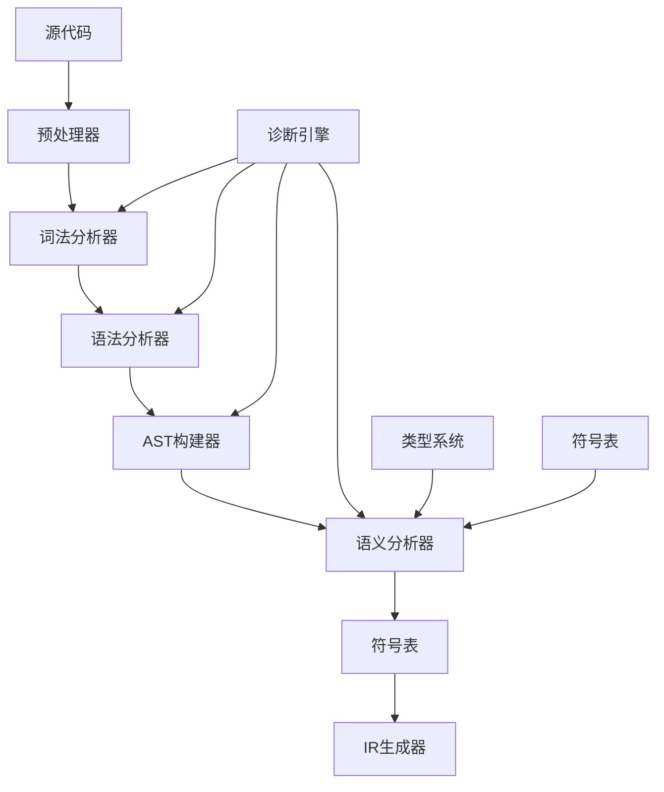
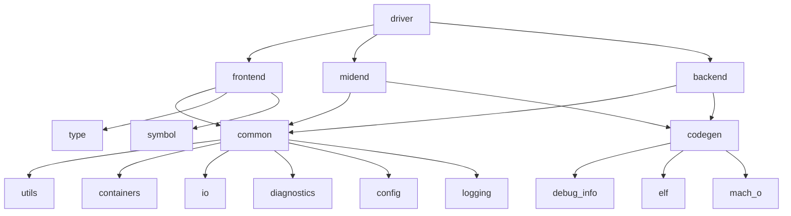

# 现代C语言编译器项目结构指南

## 目录

1. [项目概述](#项目概述)
2. [完整的目录结构说明](#完整的目录结构说明)
3. [核心文件的功能描述](#核心文件的功能描述)
4. [模块组织策略](#模块组织策略)
5. [开发工作流指导](#开发工作流指导)
6. [项目依赖管理](#项目依赖管理)
7. [文件命名规范](#文件命名规范)
8. [最佳实践](#最佳实践)

---

## 项目概述

现代C语言编译器项目采用分层的模块化架构，支持C11/C17标准，具备良好的可扩展性和维护性。本指南详细说明了项目的组织结构、文件组织和开发规范。

### 核心设计原则

- **模块化设计**: 每个模块都有明确的职责边界
- **分层架构**: 前端、中端、后端的清晰分离
- **可扩展性**: 支持插件系统和x86特性扩展
- **可测试性**: 完整的测试覆盖和工具支持
- **文档驱动**: 详细的文档和示例

---

## 完整的目录结构说明

```
modern-c-compiler/
├── src/                              # 源代码根目录
│   ├── frontend/                     # 前端处理模块
│   │   ├── lexer/                    # 词法分析器
│   │   │   ├── lexer.h               # 词法分析器主接口
│   │   │   ├── lexer.c             # 词法分析器实现
│   │   │   ├── token.h               # Token定义和数据结构
│   │   │   ├── token.c             # Token实现
│   │   │   ├── tokenizer.c         # 分词器实现
│   │   │   └── error_handler.c     # 词法错误处理
│   │   ├── parser/                   # 语法分析器
│   │   │   ├── parser.h              # 语法分析器主接口
│   │   │   ├── parser.c            # 语法分析器实现
│   │   │   ├── grammar.h             # 语法规则定义
│   │   │   ├── grammar.c           # 语法规则实现
│   │   │   ├── error_recovery.c    # 错误恢复机制
│   │   │   └── precedence.c        # 运算符优先级
│   │   ├── ast/                      # 抽象语法树
│   │   │   ├── ast.h                 # AST基础定义
│   │   │   ├── ast_nodes.h           # AST节点类型定义
│   │   │   ├── ast_nodes.c         # AST节点实现
│   │   │   ├── ast_builder.c       # AST构建器
│   │   │   ├── ast_visitor.h         # 访问者模式接口
│   │   │   ├── ast_dumper.c        # AST打印工具
│   │   │   └── ast_utils.c         # AST工具函数
│   │   ├── semanticanalyzer/         # 语义分析器
│   │   │   ├── semanticanalyzer.h    # 语义分析器接口
│   │   │   ├── semanticanalyzer.c  # 语义分析器实现
│   │   │   ├── typechecker.c       # 类型检查器
│   │   │   ├── scope_analyzer.c    # 作用域分析器
│   │   │   ├── constant_evaluator.c # 常量求值器
│   │   │   └── diagnostics.c       # 语义诊断
│   │   └── preprocessing/            # 预处理器
│   │       ├── preprocessor.h        # 预处理器接口
│   │       ├── macro_expander.cpp    # 宏展开器
│   │       ├── include_handler.cpp   # 头文件处理
│   │       └── conditional.cpp       # 条件编译
│   ├── midend/                       # 中端处理模块
│   │   ├── ir/                       # 中间表示
│   │   │   ├── ir.h                  # IR基础定义
│   │   │   ├── ir_builder.c        # IR构建器
│   │   │   ├── ir_instruction.h      # 指令定义
│   │   │   ├── ir_instruction.c    # 指令实现
│   │   │   ├── ir_types.c          # IR类型系统
│   │   │   ├── basic_block.c       # 基本块实现
│   │   │   ├── function.c          # 函数实现
│   │   │   └── module.c            # 模块实现
│   │   ├── optimizer/                # 优化器
│   │   │   ├── optimizer.h           # 优化器主接口
│   │   │   ├── optimizer.c         # 优化器实现
│   │   │   ├── optimization_pass.h   # 优化Pass基类
│   │   │   ├── pass_manager.c      # Pass管理器
│   │   │   ├── dataflow.c          # 数据流分析
│   │   │   ├── control_flow.c      # 控制流分析
│   │   │   ├── liveness.c          # 活跃变量分析
│   │   │   └── passes/               # 具体优化Pass
│   │   │       ├── constant_folding.c    # 常量折叠
│   │   │       ├── dead_code_elimination.c # 死代码消除
│   │   │       ├── common_subexpression.c # 公因子提取
│   │   │       ├── loop_optimization.c    # 循环优化
│   │   │       ├── inlining.c           # 内联展开
│   │   │       └── ssa_construction.c    # SSA构造
│   │   └── analysis/                 # 代码分析
│   │       ├── analysis.h            # 分析基类
│   │       ├── dominator_tree.cpp    # 支配树
│   │       ├── dependence_graph.cpp  # 依赖图
│   │       └── alias_analysis.cpp    # 别名分析
│   ├── backend/                      # 后端处理模块
│   │   ├── codegen/                  # 代码生成器
│   │   │   ├── codegen.h             # 代码生成器接口
│   │   │   ├── codegen.c           # 代码生成器实现
│   │   │   ├── target_machine.c    # 目标机器抽象
│   │   │   ├── target_machine.h      # 目标机器接口
│   │   │   ├── instruction_selector.c # 指令选择器
│   │   │   └── x86/                  # x86后端
│   │   │       ├── x86_backend.c   # x86后端实现
│   │   │       ├── x86_instructions.c # 指令定义
│   │   │       └── x86_assembler.c # 汇编器
│   │   ├── registeralloc/            # 寄存器分配
│   │   │   ├── register_alloc.h      # 寄存器分配器接口
│   │   │   ├── register_alloc.c    # 通用分配器
│   │   │   ├── liveness_analysis.c # 活跃变量分析
│   │   │   ├── interference_graph.c # 冲突图
│   │   │   ├── graph_coloring.c    # 图着色算法
│   │   │   ├── linear_scan.c       # 线性扫描
│   │   │   └── spill_strategy.c    # 溢出策略
│   │   └── common/                   # 后端公共代码
│   │       ├── instruction_selection.cpp # 指令选择公共代码
│   │       ├── calling_convention.cpp   # 调用约定
│   │       ├── frame_layout.cpp          # 栈帧布局
│   │       └── prologue_epilogue.cpp     # 函数 prologue/epilogue
│   ├── common/                       # 公共组件
│   │   ├── utils/                    # 工具函数
│   │   │   ├── string_utils.h        # 字符串工具
│   │   │   ├── string_utils.c      # 字符串工具实现
│   │   │   ├── hash_table.h          # 哈希表实现
│   │   │   ├── hash_table.c        # 哈希表实现
│   │   │   ├── memory_pool.h         # 内存池
│   │   │   ├── memory_pool.c       # 内存池实现
│   │   │   ├── container_utils.h     # 容器工具
│   │   │   └── file_utils.c        # 文件工具
│   │   ├── containers/               # 数据结构
│   │   │   ├── vector.h              # 向量容器
│   │   │   ├── vector.c            # 向量实现
│   │   │   ├── deque.h               # 双端队列
│   │   │   ├── deque.c             # 双端队列实现
│   │   │   ├── bst.h                 # 二叉搜索树
│   │   │   ├── bst.c               # 二叉搜索树实现
│   │   │   ├── graph.h               # 图结构
│   │   │   └── graph.c             # 图实现
│   │   ├── io/                       # IO处理
│   │   │   ├── file_reader.h         # 文件读取器
│   │   │   ├── file_reader.c       # 文件读取器实现
│   │   │   ├── output_writer.h       # 输出写入器
│   │   │   ├── output_writer.c     # 输出写入器实现
│   │   │   ├── buffer.h              # 缓冲区
│   │   │   └── buffer.c            # 缓冲区实现
│   │   ├── diagnostics/              # 诊断系统
│   │   │   ├── diagnostic_engine.h   # 诊断引擎
│   │   │   ├── diagnostic_engine.c # 诊断引擎实现
│   │   │   ├── error_reporter.h      # 错误报告器
│   │   │   ├── error_reporter.c    # 错误报告器实现
│   │   │   ├── source_location.h     # 源码位置
│   │   │   ├── source_location.c   # 源码位置实现
│   │   │   ├── diagnostic_consumer.h # 诊断消费者
│   │   │   └── formatting.c        # 格式化工具
│   │   ├── config/                   # 配置管理
│   │   │   ├── config.h              # 配置接口
│   │   │   ├── config.c            # 配置实现
│   │   │   ├── command_line.c      # 命令行解析
│   │   │   └── target_config.c     # 目标配置
│   │   └── logging/                  # 日志系统
│   │       ├── logger.h              # 日志器接口
│   │       ├── logger.cpp            # 日志器实现
│   │       ├── log_level.h           # 日志级别
│   │       └── log_formatter.cpp     # 日志格式化
│   ├── type/                         # 类型系统
│   │   ├── types.h                   # 类型系统基础定义
│   │   ├── types.c                 # 类型系统实现
│   │   ├── type_builder.c          # 类型构建器
│   │   ├── type_comparison.c       # 类型比较
│   │   ├── type_layout.c           # 类型布局计算
│   │   ├── builtin_types.c         # 内建类型
│   │   ├── array_type.c            # 数组类型
│   │   ├── struct_type.c           # 结构体类型
│   │   ├── union_type.c            # 联合体类型
│   │   ├── function_type.c         # 函数类型
│   │   ├── pointer_type.c          # 指针类型
│   │   ├── atomic_type.c           # 原子类型(C11)
│   │   └── aligned_type.c          # 对齐类型(C11)
│   ├── symbol/                       # 符号表管理
│   │   ├── symbol_table.h            # 符号表接口
│   │   ├── symbol_table.c          # 符号表实现
│   │   ├── symbol.h                  # 符号定义
│   │   ├── symbol.c                # 符号实现
│   │   ├── scope.h                   # 作用域定义
│   │   ├── scope.c                 # 作用域实现
│   │   ├── name_lookup.c           # 名称查找
│   │   ├── symbol_visitor.c        # 符号访问者

## 核心文件的功能描述

### 主要头文件的作用和接口定义

#### 公共API头文件 (`include/modern-c-compiler/public_api.h`)

**功能**: 提供编译器的公共接口，隐藏内部实现细节

**主要内容**:
```c
// 编译器主接口
#ifndef PUBLIC_API_H
#define PUBLIC_API_H

#include <stdbool.h>
#include <stddef.h>

// 前向声明
typedef struct Compiler Compiler;
typedef struct CompileOptions CompileOptions;
typedef struct CompileResult CompileResult;
typedef struct Diagnostic Diagnostic;
typedef struct VersionInfo VersionInfo;

// 编译器接口
typedef struct Compiler {
    // 私有实现数据
    void* privateData;
    
    // 函数指针表
    void (*setOptions)(Compiler* compiler, const CompileOptions* options);
    void (*getOptions)(const Compiler* compiler, CompileOptions* options);
    bool (*compileFile)(Compiler* compiler, const char* filename);
    bool (*compileSource)(Compiler* compiler, const char* source, const char* filename);
    bool (*compileFiles)(Compiler* compiler, const char** files, size_t count);
    void (*getResult)(const Compiler* compiler, CompileResult* result);
    bool (*hasErrors)(const Compiler* compiler);
    void (*getDiagnostics)(const Compiler* compiler, struct Vector* diagnostics); // Diagnostic*
} Compiler;

// 版本信息
struct VersionInfo {
    int major;
    int minor;
    int patch;
    char* preRelease;
    char* build;
};

// 编译器构造函数和析构函数
Compiler* createCompiler(void);
void destroyCompiler(Compiler* compiler);

// 版本信息获取
VersionInfo getVersion(void);

// 工具函数
bool validateSourceFile(const char* filename);
char* getDefaultOutputFilename(const char* inputFile);
bool isValidX86Target(const char* targetTriple);

#endif // PUBLIC_API_H
```

#### 诊断系统头文件 (`src/common/diagnostics/diagnostic_engine.h`)

**功能**: 提供统一的错误报告和诊断信息管理

**接口定义**:
```c
// diagnostic_engine.h
#ifndef DIAGNOSTIC_ENGINE_H
#define DIAGNOSTIC_ENGINE_H

#include <stdbool.h>
#include <stddef.h>

// 诊断级别
typedef enum {
    DIAG_ERROR,
    DIAG_WARNING,
    DIAG_NOTE,
    DIAG_REMARK
} DiagnosticLevel;

// 源位置信息
typedef struct {
    char* filename;
    size_t line;
    size_t column;
    size_t offset;
} SourceLocation;

// 诊断引擎
typedef struct {
    // 私有数据
    void* privateData;
    
    // 函数指针表
    void (*reportError)(struct DiagnosticEngine* engine,
                       SourceLocation location,
                       const char* message);
    void (*reportWarning)(struct DiagnosticEngine* engine,
                         SourceLocation location,
                         const char* message);
    void (*reportNote)(struct DiagnosticEngine* engine,
                      SourceLocation location,
                      const char* message);
    void (*reportRemark)(struct DiagnosticEngine* engine,
                        SourceLocation location,
                        const char* message);
    
    char* (*formatDiagnostic)(const struct DiagnosticEngine* engine,
                             DiagnosticLevel level,
                             const SourceLocation* location,
                             const char* message);
    
    // 诊断控制
    void (*setErrorLimit)(struct DiagnosticEngine* engine, size_t limit);
    void (*setWarningsAsErrors)(struct DiagnosticEngine* engine, bool enabled);
    void (*enableAllWarnings)(struct DiagnosticEngine* engine);
    void (*disableWarning)(struct DiagnosticEngine* engine, const char* warningId);
    
    // 查询诊断状态
    bool (*hasErrors)(const struct DiagnosticEngine* engine);
    size_t (*getErrorCount)(const struct DiagnosticEngine* engine);
    size_t (*getWarningCount)(const struct DiagnosticEngine* engine);
} DiagnosticEngine;

// 构造函数和析构函数
DiagnosticEngine* createDiagnosticEngine(void);
void destroyDiagnosticEngine(DiagnosticEngine* engine);

// 便捷函数
bool sourceLocationIsValid(const SourceLocation* location);
char* sourceLocationToString(const SourceLocation* location);

#endif // DIAGNOSTIC_ENGINE_H
```

#### 符号表头文件 (`src/symbol/symbol_table.h`)

**功能**: 管理符号的定义、查找和作用域

**接口定义**:
```c
// symbol_table.h
#ifndef SYMBOL_TABLE_H
#define SYMBOL_TABLE_H

#include <stdbool.h>
#include <stddef.h>

// 前向声明
typedef struct Type Type;
typedef struct Symbol Symbol;
typedef struct Scope Scope;
typedef struct SymbolTable SymbolTable;

// 符号类型
typedef enum {
    SYMBOL_VARIABLE,
    SYMBOL_FUNCTION,
    SYMBOL_TYPE,
    SYMBOL_ENUM_CONSTANT,
    SYMBOL_MACRO,
    SYMBOL_LABEL
} SymbolKind;

// 符号结构
struct Symbol {
    // 符号属性
    char* name;
    SymbolKind kind;
    Type* type;
    SourceLocation location;
    
    // 存储信息
    bool isDefined;
    bool isExtern;
    bool isStatic;
    bool isConst;
    int storageSize;
    int alignment;
    
    // 值信息
    void* value; // 用于常量值
    struct Vector* initialData; // uint8_t*
    
    // 引用计数
    int refCount;
    
    // 私有数据
    void* privateData;
};

// 符号表接口
struct SymbolTable {
    // 私有数据
    void* privateData;
    
    // 函数指针表
    void (*enterScope)(SymbolTable* table);
    void (*exitScope)(SymbolTable* table);
    Scope* (*getCurrentScope)(const SymbolTable* table);
    Scope* (*getGlobalScope)(const SymbolTable* table);
    
    // 符号管理
    bool (*addSymbol)(SymbolTable* table, Symbol* symbol);
    Symbol* (*lookup)(const SymbolTable* table, const char* name);
    Symbol* (*lookupInCurrentScope)(const SymbolTable* table, const char* name);
    Symbol* (*lookupRecursive)(const SymbolTable* table, const char* name);
    
    // 工具方法
    int (*getScopeLevel)(const SymbolTable* table);
    bool (*isInGlobalScope)(const SymbolTable* table);
    void (*dump)(const SymbolTable* table, FILE* os);
};

// 构造函数和析构函数
SymbolTable* createSymbolTable(void);
void destroySymbolTable(SymbolTable* table);

// 符号构造函数
Symbol* createSymbol(const char* name, SymbolKind kind, SourceLocation location);
void destroySymbol(Symbol* symbol);

// 符号辅助方法
bool symbolIsVariable(const Symbol* symbol);
bool symbolIsFunction(const Symbol* symbol);
bool symbolIsType(const Symbol* symbol);

#endif // SYMBOL_TABLE_H
```

### 关键源文件的职责和实现要点

#### 词法分析器实现 (`src/frontend/lexer/lexer.c`)

**职责**: 将字符流转换为token流

**实现要点**:
```c
// lexer.h
#ifndef LEXER_H
#define LEXER_H

#include <stdbool.h>
#include <stddef.h>

// 前向声明
typedef struct Token Token;
typedef struct DiagnosticEngine DiagnosticEngine;
typedef struct SourceLocation SourceLocation;
typedef struct HashTable HashTable;
typedef struct Vector Vector;

// 词法分析器结构体
typedef struct {
    char* source;
    size_t position;
    size_t line;
    size_t column;
    SourceLocation currentLocation;
    DiagnosticEngine* diagnostics;
    
    // 关键字表
    HashTable* keywords;
    
    // 私有数据
    void* privateData;
} Lexer;

// 构造函数和析构函数
Lexer* createLexer(const char* source, DiagnosticEngine* diagnostics);
void destroyLexer(Lexer* lexer);

// 主要接口
Vector* lexerTokenize(Lexer* lexer);  // Vector<Token>*
Token lexerNextToken(Lexer* lexer);
bool lexerHasMoreTokens(const Lexer* lexer);

// 私有方法（在实现文件中）
static char lexerPeekChar(Lexer* lexer);
static char lexerGetChar(Lexer* lexer);
static void lexerSkipWhitespace(Lexer* lexer);
static Token lexerReadStringLiteral(Lexer* lexer);
static Token lexerReadNumberLiteral(Lexer* lexer);
static Token lexerReadIdentifier(Lexer* lexer);
static Token lexerReadOperator(Lexer* lexer);

// 错误处理
static void lexerReportError(Lexer* lexer, const char* message);
static void lexerReportUnexpectedCharacter(Lexer* lexer, char c);

#endif // LEXER_H
```

**关键特性**:
- 支持Unicode字符
- 智能错误恢复
- 行号和列号跟踪
- 高效的状态机实现

#### IR构建器实现 (`src/midend/ir/ir_builder.c`)

**职责**: 从AST生成中间表示

**实现要点**:
```c
// ir_builder.h
#ifndef IR_BUILDER_H
#define IR_BUILDER_H

#include <stdbool.h>
#include <stddef.h>

// 前向声明
typedef struct Module Module;
typedef struct Function Function;
typedef struct BasicBlock BasicBlock;
typedef struct Value Value;
typedef struct Type Type;
typedef struct Instruction Instruction;
typedef struct ASTNode ASTNode;
typedef struct HashTable HashTable;

// IR构建器结构体
typedef struct {
    Module* currentModule;
    Function* currentFunction;
    BasicBlock* currentBlock;
    HashTable* valueMap;  // ASTNode* -> Value*
    
    // 私有数据
    void* privateData;
} IRBuilder;

// 构造函数和析构函数
IRBuilder* createIRBuilder(Module* module);
void destroyIRBuilder(IRBuilder* builder);

// 主要转换方法
Value* irBuilderConvertExpression(IRBuilder* builder, ASTNode* expr);
void irBuilderConvertStatement(IRBuilder* builder, ASTNode* stmt);
void irBuilderConvertDeclaration(IRBuilder* builder, ASTNode* decl);

// 类型辅助方法
Type* irBuilderConvertType(IRBuilder* builder, Type* type);

// 值创建方法
Value* irBuilderCreateConstant(IRBuilder* builder, Type* type, void* value);
Instruction* irBuilderCreateBinaryOp(IRBuilder* builder, int op, Value* lhs, Value* rhs);
Instruction* irBuilderCreateLoad(IRBuilder* builder, Type* type, Value* ptr);
Instruction* irBuilderCreateStore(IRBuilder* builder, Value* ptr, Value* value);

// 辅助方法
void irBuilderSetInsertPoint(IRBuilder* builder, BasicBlock* block);
BasicBlock* irBuilderCreateBasicBlock(IRBuilder* builder, const char* name);
Value* irBuilderGetValue(IRBuilder* builder, ASTNode* node);
void irBuilderSetValue(IRBuilder* builder, ASTNode* node, Value* value);

#endif // IR_BUILDER_H
```

#### 代码生成器实现 (`src/backend/codegen/codegen.c`)

**职责**: 将IR转换为目标代码

**实现要点**:
```c
// codegen.h
#ifndef CODEGEN_H
#define CODEGEN_H

#include <stdbool.h>
#include <stddef.h>
#include <stdio.h>

// 前向声明
typedef struct TargetMachine TargetMachine;
typedef struct RegisterAllocator RegisterAllocator;
typedef struct InstructionSelector InstructionSelector;
typedef struct Function Function;
typedef struct BasicBlock BasicBlock;
typedef struct CallInstruction CallInstruction;

// 代码生成器结构体
typedef struct {
    // 目标机器和组件
    TargetMachine* targetMachine;
    RegisterAllocator* regAllocator;
    InstructionSelector* instSelector;
    
    // 输出流
    FILE* output;
    
    // 私有数据
    void* privateData;
} CodeGenerator;

// 构造函数和析构函数
CodeGenerator* createCodeGenerator(TargetMachine* targetMachine,
                                 RegisterAllocator* regAllocator,
                                 InstructionSelector* instSelector);
void destroyCodeGenerator(CodeGenerator* codegen);

// 代码生成辅助方法
void codegenEmitPrologue(CodeGenerator* codegen, Function* func);
void codegenEmitEpilogue(CodeGenerator* codegen, Function* func);
void codegenEmitFunctionCall(CodeGenerator* codegen, CallInstruction* call);
void codegenEmitBasicBlock(CodeGenerator* codegen, BasicBlock* block);

// 寄存器分配
void codegenAllocateRegisters(CodeGenerator* codegen, Function* func);

#endif // CODEGEN_H
```
        

## 模块组织策略

### 前端模块的文件组织方式

#### 层次化组织结构

```
frontend/
├── lexer/           # 词法分析层
├── parser/          # 语法分析层
├── ast/             # 抽象语法树层
├── semanticanalyzer/ # 语义分析层
└── preprocessing/   # 预处理层
```

#### 模块间依赖关系



#### 关键设计原则

1. **分层依赖**: 每层只依赖于下面的层
2. **接口隔离**: 层间通过明确的接口通信
3. **错误传播**: 错误可以向上层传播
4. **数据流**: 通过数据流传递信息

### 中端优化模块的文件组织方式

#### 插件化优化框架

```
midend/
├── ir/                     # 基础IR结构
├── optimizer/              # 优化器核心
│   ├── passes/             # 具体优化Pass
│   ├── analysis/           # 分析算法
│   └── framework/          # 优化框架
└── plugins/                # 扩展优化Pass
```

#### 优化Pass分类

```c
// optimization_pass.h
#ifndef OPTIMIZATION_PASS_H
#define OPTIMIZATION_PASS_H

#include <stdbool.h>
#include <stddef.h>

// 前向声明
typedef struct Module Module;
typedef struct Function Function;
typedef struct BasicBlock BasicBlock;
typedef struct Instruction Instruction;

// Pass类型枚举
typedef enum {
    PASS_MODULE,        // 模块级优化
    PASS_FUNCTION,      // 函数级优化
    PASS_BASIC_BLOCK,   // 基本块级优化
    PASS_INSTRUCTION    // 指令级优化
} PassKind;

// Pass基类（使用函数指针实现多态）
typedef struct {
    PassKind kind;
    char* name;
    bool isRequired;
    
    // 函数指针表
    bool (*runOnModule)(struct Pass* self, Module* module);
    bool (*runOnFunction)(struct Pass* self, Function* func);
    bool (*runOnBasicBlock)(struct Pass* self, BasicBlock* block);
    bool (*runOnInstruction)(struct Pass* self, Instruction* inst);
    
    // 销毁函数
    void (*destroy)(struct Pass* self);
    
    // 私有数据
    void* privateData;
} Pass;

// 具体Pass示例

// 常量折叠Pass
typedef struct {
    Pass base;
    // 私有数据
    size_t constantsFolded;
} ConstantFoldingPass;

// 死代码消除Pass
typedef struct {
    Pass base;
    // 私有数据
    size_t instructionsRemoved;
    size_t basicBlocksRemoved;
} DeadCodeEliminationPass;

// 循环优化Pass
typedef struct {
    Pass base;
    // 私有数据
    size_t loopsOptimized;
} LoopOptimizationPass;

// 构造函数
Pass* createConstantFoldingPass(void);
Pass* createDeadCodeEliminationPass(void);
Pass* createLoopOptimizationPass(void);

#endif // OPTIMIZATION_PASS_H
```

#### 优化器管理器

```c
// pass_manager.h
#ifndef PASS_MANAGER_H
#define PASS_MANAGER_H

#include <stdbool.h>
#include <stddef.h>

// 前向声明
typedef struct Pass Pass;
typedef struct Module Module;
typedef struct Function Function;
typedef struct Vector Vector;

// Pass管理器结构体
typedef struct {
    Vector* passes;  // Pass*
    
    // 统计信息
    struct {
        size_t totalRuns;
        size_t successfulRuns;
        size_t failedRuns;
    } statistics;
    
    // 私有数据
    void* privateData;
} PassManager;

// 构造函数和析构函数
PassManager* createPassManager(void);
void destroyPassManager(PassManager* manager);

// Pass管理器操作
bool passManagerAddPass(PassManager* manager, Pass* pass);
bool passManagerRun(PassManager* manager, Module* module);
bool passManagerRunOnFunction(PassManager* manager, Function* function);

// 统计信息
size_t passManagerGetTotalRuns(const PassManager* manager);
size_t passManagerGetSuccessfulRuns(const PassManager* manager);
size_t passManagerGetFailedRuns(const PassManager* manager);

#endif // PASS_MANAGER_H
```

### 后端代码生成模块的文件组织方式

#### x86专用架构

```
backend/
├── codegen/            # 代码生成器
├── registeralloc/      # 寄存器分配
├── common/            # 公共后端代码
└── x86/               # x86目标
```

#### 目标机器抽象

```c
// target_machine.h
#ifndef TARGET_MACHINE_H
#define TARGET_MACHINE_H

#include <stdbool.h>
#include <stddef.h>
#include <stdio.h>

// 前向声明
typedef struct RegisterInfo RegisterInfo;
typedef struct InstructionInfo InstructionInfo;
typedef struct DataLayout DataLayout;
typedef struct Function Function;
typedef struct Module Module;

// 目标机器函数指针表
typedef struct {
    // 销毁函数
    void (*destroy)(struct TargetMachine* self);
    
    // 目标信息
    const char* (*getTriple)(const struct TargetMachine* self);
    const RegisterInfo* (*getRegisterInfo)(const struct TargetMachine* self);
    const InstructionInfo* (*getInstructionInfo)(const struct TargetMachine* self);
    
    // 数据布局
    const DataLayout* (*getDataLayout)(const struct TargetMachine* self);
    
    // 代码生成
    bool (*emitFunction)(struct TargetMachine* self, Function* func, FILE* output);
    bool (*emitModule)(struct TargetMachine* self, Module* module, FILE* output);
} TargetMachineVTable;

// 目标机器基类
typedef struct {
    const TargetMachineVTable* vtable;
    void* privateData;
} TargetMachine;

// 具体目标实现
typedef struct {
    TargetMachine base;
    // x86特定数据
    struct {
        bool hasSSE2;
        bool hasAVX;
        bool hasAVX2;
        char* cpuModel;
    } x86Info;
} X86TargetMachine;

// 构造函数
TargetMachine* createX86TargetMachine(void);

// 目标机器操作（通过函数指针表调用）
static inline const char* targetMachineGetTriple(const TargetMachine* machine) {
    return machine->vtable->getTriple(machine);
}

static inline const RegisterInfo* targetMachineGetRegisterInfo(const TargetMachine* machine) {
    return machine->vtable->getRegisterInfo(machine);
}

static inline const InstructionInfo* targetMachineGetInstructionInfo(const TargetMachine* machine) {
    return machine->vtable->getInstructionInfo(machine);
}

static inline const DataLayout* targetMachineGetDataLayout(const TargetMachine* machine) {
    return machine->vtable->getDataLayout(machine);
}

static inline bool targetMachineEmitFunction(TargetMachine* machine, Function* func, FILE* output) {
    return machine->vtable->emitFunction(machine, func, output);
}

static inline bool targetMachineEmitModule(TargetMachine* machine, Module* module, FILE* output) {
    return machine->vtable->emitModule(machine, module, output);
}

#endif // TARGET_MACHINE_H
```

#### 指令选择器

```cpp
namespace backend {
    class InstructionSelector {
    private:
        TargetMachine* target_;
        DAGISelDAG dag_; // 指令选择DAG
        
    public:
        explicit InstructionSelector(TargetMachine* target);
        
        // 指令选择算法
        void selectInstructions(ir::Function& function);
        void selectBasicBlock(ir::BasicBlock* block);
        
        // 模式匹配
        void matchPattern(SDNode* node, const std::vector<Instruction*>& candidates);

## 开发工作流指导

### 新功能开发的文件添加流程

#### 1. 功能需求分析阶段

**文档要求**:
- 创建功能设计文档 (`docs/design/feature_name.md`)
- 确定功能的影响范围和依赖关系
- 更新项目路线图 (`docs/roadmap.md`)

**示例文档结构**:
```markdown
# 功能名称设计文档

## 概述
功能描述和目标

## 需求分析
- 功能需求
- 非功能需求
- 约束条件

## 设计方案
- 接口设计
- 实现策略
- 算法选择

## 依赖关系
- 现有模块依赖
- 新增依赖
- 第三方库依赖

## 实现计划
- 任务分解
- 时间估算
- 风险评估

## 测试策略
- 单元测试
- 集成测试
- 性能测试
```

#### 2. 代码结构规划阶段

**目录结构确定**:
- 确定功能归属的模块目录
- 规划头文件和源文件的组织
- 决定接口文件的导出级别

**文件命名规范**:
```cpp
// 头文件命名: feature_name.h
// 源文件命名: feature_name.cpp
// 测试文件命名: feature_name_tests.cpp
// 工具文件命名: feature_name_utils.cpp

// 示例: 新的优化Pass
// include/modern-c-compiler/optimization/ssa_construction.h
// src/midend/optimizer/passes/ssa_construction.cpp
// test/unit/optimizer/ssa_construction_tests.cpp
```

#### 3. 接口设计阶段

**头文件组织原则**:
```cpp
// 1. 头文件保护
#ifndef MODERN_C_COMPILER_SSA_CONSTRUCTION_H
#define MODERN_C_COMPILER_SSA_CONSTRUCTION_H

// 2. 公共接口 (对外)
namespace modern_c_compiler {
namespace optimization {

// 公共类声明
class SSAConstructionPass;

// 公共函数声明
std::unique_ptr<SSAConstructionPass> createSSAPass();

} // namespace optimization
} // namespace modern_c_compiler

// 3. 内部实现 (对内)
namespace modern_c_compiler {
namespace optimization {
namespace internal {

// 内部类和函数
class SSADestructor;
void cleanupSSAData();

} // namespace internal
} // namespace optimization
} // namespace modern_c_compiler

#endif // MODERN_C_COMPILER_SSA_CONSTRUCTION_H
```

#### 4. 实现阶段

**文件添加清单**:
```bash
# 创建目录结构
mkdir -p src/midend/optimizer/passes/ssa_construction
mkdir -p test/unit/optimizer/ssa_construction
mkdir -p docs/optimization/ssa_construction
mkdir -p examples/optimization/ssa_construction

# 添加文件
touch src/midend/optimizer/passes/ssa_construction/ssa_construction.h
touch src/midend/optimizer/passes/ssa_construction/ssa_construction.cpp
touch test/unit/optimizer/ssa_construction/ssa_construction_tests.cpp
touch docs/optimization/ssa_construction/design.md
touch examples/optimization/ssa_construction/basic_example.c
```

#### 5. CMake集成

**添加构建配置**:
```cmake
# 在相应的CMakeLists.txt中添加
set(SSA_CONSTRUCTION_SOURCES
    src/midend/optimizer/passes/ssa_construction/ssa_construction.cpp
)

set(SSA_CONSTRUCTION_HEADERS
    include/modern-c-compiler/optimization/ssa_construction.h
)

# 添加到库中
target_sources(modern_c_compiler PRIVATE
    ${SSA_CONSTRUCTION_SOURCES}
    ${SSA_CONSTRUCTION_HEADERS}
)

# 添加测试
if(BUILD_TESTING)
    add_test_case(ssa_construction_tests
        SOURCES test/unit/optimizer/ssa_construction/ssa_construction_tests.cpp
        LINK_LIBS modern_c_compiler gtest
    )
endif()
```

### 代码组织最佳实践

#### 1. 命名约定

**文件命名**:
- 使用小写字母和下划线
- 体现功能模块归属
- 避免缩写，使用完整单词

**类命名**:
```cpp
// 正确
class CodeGenerator;
class RegisterAllocator;
class OptimizationPass;

// 避免
class Codegen;
class RegAlloc;
class OptPass;
```

**函数命名**:
```cpp
// 使用动词短语
void allocateRegisters();
bool generateMachineCode();
std::unique_ptr<IR> optimizeIR();

// 避免
void allocation();
bool generate();
std::unique_ptr<IR> optimize();
```

#### 2. 模块接口设计

**单一职责原则**:
```cpp
// 好的设计: 职责单一
class Lexer {
public:
    std::vector<Token> tokenize(const std::string& source);
};

class Token {
public:
    enum class Kind { /* ... */ };
    Kind getKind() const;
    std::string getText() const;
    SourceLocation getLocation() const;
};

## 项目依赖管理

### 外部库的使用和集成方式

#### 1. 必需依赖

**CMake依赖声明**:
```cmake
# CMakeLists.txt 根文件
find_package(Threads REQUIRED)
find_package(GMP QUIET)  # GMP大整数库，可选

# 条件依赖
if(ENABLE_OPTIMIZATION)
    find_package(LLVM QUIET)
    if(LLVM_FOUND)
        set(HAVE_LLVM TRUE)
        include_directories(${LLVM_INCLUDE_DIRS})
        link_directories(${LLVM_LIBRARY_DIRS})
    endif()
endif()

# 编译时宏定义
if(HAVE_LLVM)
    add_definitions(-DHAVE_LLVM)
endif()

if(GMP_FOUND)
    add_definitions(-DHAVE_GMP)
endif()
```

**依赖头文件包装**:
```cpp
// include/modern-c-compiler/dependencies.h
#pragma once

#include "config.h"  // 从cmake生成

// GMP支持
#ifdef HAVE_GMP
#include <gmp.h>
namespace gmp_utils {
    using BigInt = mpz_t;
}
#else
namespace gmp_utils {
    // 提供模拟实现
    class BigInt {
        // 简化的实现或错误提示
    };
}
#endif

// LLVM支持
#ifdef HAVE_LLVM
#include <llvm/IR/IRBuilder.h>
#include <llvm/IR/Module.h>
namespace llvm_utils {
    using IRBuilder = ::llvm::IRBuilder<>;
    using Module = ::llvm::Module;
}
#else
namespace llvm_utils {
    // 提供模拟实现
    class IRBuilder {};
    class Module {};
}
#endif

// 线程支持
#include <thread>
#include <future>
namespace thread_utils {
    template<typename Func, typename... Args>
    auto asyncExecute(Func&& func, Args&&... args) {
        return std::async(std::launch::async, 
                         std::forward<Func>(func), 
                         std::forward<Args>(args)...);
    }
}
```

#### 2. 可选依赖处理

**运行时动态检测**:
```cpp
// src/common/system/system_info.cpp
namespace system {
    class SystemInfo {
    public:
        static bool hasAVXSupport() {
            // 检查AVX指令集支持
            unsigned int eax, ebx, ecx, edx;
            __asm__ __volatile__(
                "cpuid"
                : "=a"(eax), "=b"(ebx), "=c"(ecx), "=d"(edx)
                : "a"(1)
            );
            return (ecx & (1 << 28)) != 0;
        }
        
        static size_t getCPUCount() {
            return std::thread::hardware_concurrency();
        }
        
        static size_t getMemorySize() {
            // 简单的内存大小检测
            long pages = sysconf(_SC_PHYS_PAGES);
            long page_size = sysconf(_SC_PAGE_SIZE);
            return pages * page_size;
        }
    };
}
```

**特性检测宏**:
```cpp
// config.h (从CMake生成)
#pragma once

// 系统信息
#define SYSTEM_CPU_COUNT @CMAKE_SYSTEM_PROCESSOR@
#define SYSTEM_HAS_AVX @ENABLE_AVX_SUPPORT@

// 依赖库版本
#define GMP_VERSION "@GMP_VERSION@"
#define LLVM_VERSION "@LLVM_VERSION@"

// 编译器特性
#define HAVE_RTTI @ENABLE_RTTI@
#define HAVE_EXCEPTIONS @ENABLE_EXCEPTIONS@

// 调试构建
#ifdef DEBUG
#define ENABLE_DEBUG 1
#else
#define ENABLE_DEBUG 0
#endif

// 构建信息
#define BUILD_DATE "@BUILD_DATE@"
#define BUILD_COMMIT "@BUILD_COMMIT@
```

### 内部模块的依赖关系图

#### 模块依赖层次



#### 依赖管理原则

**1. 层次化依赖**:
```cpp
// 高层模块不应直接依赖低层模块的具体实现
// driver可以依赖frontend接口，但不能依赖lexer具体实现

// 好的设计: 依赖抽象
#include "frontend/frontend.h"  // 抽象接口
#include "midend/optimizer.h"   // 抽象接口

// 避免: 依赖具体实现
#include "frontend/lexer/lexer.h"        // 具体实现
#include "frontend/parser/parser.cpp"    // 实现文件
```

**2. 依赖注入**:
```cpp

## 文件命名规范

### 1. 通用命名约定

**文件扩展名**:
- `.h` - C头文件
- `.c` - C源文件
- `.md` - Markdown文档
- `.txt` - 文本文件
- `.xml` - XML配置文件
- `.json` - JSON配置文件

**目录命名**:
- 使用小写字母和下划线
- 体现模块功能
- 避免缩写

### 2. 头文件命名

**格式**: `module_name.h`

**示例**:
```cpp
// 核心组件
compiler.h           // 编译器主接口
diagnostics.h        // 诊断系统
types.h             // 类型系统

// 前端组件
lexer.h             // 词法分析器
parser.h            // 语法分析器
ast.h               // 抽象语法树
semanticanalyzer.h  // 语义分析器

// 中端组件
ir.h                // 中间表示
optimizer.h         // 优化器

// 后端组件
codegen.h           // 代码生成器
registeralloc.h     // 寄存器分配
target_machine.h    // 目标机器

// 公共组件
utils.h             // 工具函数
containers.h        // 容器类
io.h               // 输入输出
config.h           // 配置管理
```

### 3. 源文件命名

**格式**: `module_name.c`

**对应关系**:
```c
// 头文件和源文件对应
include/modern-c-compiler/lexer.h     ↔ src/frontend/lexer/lexer.c
include/modern-c-compiler/parser.h    ↔ src/frontend/parser/parser.c
include/modern-c-compiler/ast.h       ↔ src/frontend/ast/ast.c
include/modern-c-compiler/ir.h        ↔ src/midend/ir/ir.c
include/modern-c-compiler/optimizer.h ↔ src/midend/optimizer/optimizer.c
include/modern-c-compiler/codegen.h   ↔ src/backend/codegen/codegen.c
```

### 4. 测试文件命名

**格式**: `module_name_tests.c`

**示例**:
```c
// 单元测试
lexer_tests.c
parser_tests.c
ast_tests.c
semantic_tests.c
ir_tests.c
optimizer_tests.c
codegen_tests.c
type_tests.c
symbol_tests.c

// 集成测试
frontend_integration_tests.c
backend_integration_tests.c
end_to_end_tests.c
pipeline_tests.c

// 性能测试
compiler_performance_tests.c
optimizer_performance_tests.c
codegen_performance_tests.c
```

### 5. 配置文件命名

**CMake文件**:
```
CMakeLists.txt           # 主构建文件
cmake/                   # CMake模块目录
    FindDependencies.cmake   # 依赖查找
    CompilerOptions.cmake    # 编译器选项
    BuildType.cmake         # 构建类型
    TestConfig.cmake        # 测试配置
    DetectPlatform.cmake    # 平台检测
```

**项目配置文件**:
```
.gitignore           # Git忽略文件
.gitattributes       # Git属性配置
.editorconfig        # 编辑器配置
.clang-format        # Clang格式化配置
.clang-tidy          # Clang静态分析配置
```

---

## 最佳实践

### 1. 代码质量标准

**编码规范**:
- 使用C++17标准特性
- 遵循Google C++ Style Guide
- 启用编译器警告为错误
- 使用静态分析工具

**示例代码风格**:
```c
// 头文件示例
#ifndef MODERN_C_COMPILER_EXAMPLE_H
#define MODERN_C_COMPILER_EXAMPLE_H

#include <stdbool.h>
#include <stddef.h>
#include <stdio.h>

//! @brief 简明的功能描述
//! @details 详细的功能描述，包括使用场景和注意事项
typedef struct ExampleClass {
    char* name;
    int* data;
    size_t data_size;
    
    // 私有数据
    void* private_data;
} ExampleClass;

//! @brief 工具函数描述
//! @param input 输入参数描述
//! @return 返回值描述
int processInput(const char* input);

// 构造函数和析构函数
ExampleClass* createExampleClass(const char* name);
void destroyExampleClass(ExampleClass* example);

// 公共接口
void exampleClassDoSomething(ExampleClass* example);
int exampleClassCalculate(ExampleClass* example, int x, int y);
const char* exampleClassGetName(const ExampleClass* example);

// 静态方法
ExampleClass* exampleClassCreate(const char* name);

#endif // MODERN_C_COMPILER_EXAMPLE_H
```

### 2. 错误处理最佳实践

**RAII原则**:
```cpp
class ResourceManager {
private:
    std::unique_ptr<Resource> resource_;
    bool owns_resource_ = false;
    
public:
    explicit ResourceManager(std::unique_ptr<Resource> resource)
        : resource_(std::move(resource)), owns_resource_(true) {}
    
    ~ResourceManager() {
        if (owns_resource_ && resource_) {
            resource_->cleanup();
        }
    }
    
    // 禁止拷贝，允许移动
    ResourceManager(const ResourceManager&) = delete;
    ResourceManager& operator=(const ResourceManager&) = delete;
    
    ResourceManager(ResourceManager&& other) noexcept
        : resource_(std::move(other.resource_))
        , owns_resource_(other.owns_resource_) {
        other.owns_resource_ = false;
    }
    
    ResourceManager& operator=(ResourceManager&& other) noexcept {
        if (this != &other) {
            if (owns_resource_ && resource_) {
                resource_->cleanup();
            }
            
            resource_ = std::move(other.resource_);
            owns_resource_ = other.owns_resource_;
            other.owns_resource_ = false;
        }
        return *this;
    }
};
```

**异常安全保证**:
```cpp
class SafeContainer {
private:
    std::vector<int> data_;
    
public:
    void addItems(const std::vector<int>& items) {
        // 基本保证: 不会泄露资源
        std::vector<int> temp;
        temp.reserve(data_.size() + items.size());
        
        // 强保证: 操作要么完全成功，要么完全失败
        try {
            temp.insert(temp.end(), data_.begin(), data_.end());
            temp.insert(temp.end(), items.begin(), items.end());
            data_.swap(temp);
        } catch (...) {
            // 清理临时数据
            temp.clear();
            throw;
        }
    }
    
    // 无异常保证的操作
    int getSize() const noexcept {
        return static_cast<int>(data_.size());
    }
};
```

### 3. 性能优化指南

**内存管理**:
```cpp
// 使用对象池减少内存分配
template<typename T>
class ObjectPool {
private:
    std::vector<std::unique_ptr<T[]>> pools_;
    size_t current_pool_size_ = 0;
    static constexpr size_t INITIAL_POOL_SIZE = 1024;
    
public:
    T* acquire() {
        // 从池中获取或创建新对象
        if (current_pool_size_ == 0) {
            // 分配新池
            auto new_pool = std::make_unique<T[]>(INITIAL_POOL_SIZE);
            pools_.push_back(std::move(new_pool));
            current_pool_size_ = INITIAL_POOL_SIZE;
        }
        
        return &pools_.back()[--current_pool_size_];
    }
    
    void release(T* obj) {
        // 归还到池中（如果池还有空间）
        if (current_pool_size_ < INITIAL_POOL_SIZE) {
            current_pool_size_++;
        }
        // 否则丢弃，让系统回收
    }
};
```

**算法优化**:
```cpp
// 使用移动语义避免不必要的拷贝
class Compiler {
private:
    std::vector<std::unique_ptr<Module>> modules_;
    
public:
    // 移动语义版本
    void addModule(std::unique_ptr<Module> module) {
        modules_.push_back(std::move(module));
    }
    
    // 拷贝语义版本（避免）
    void addModuleCopy(const Module& module) {
        modules_.push_back(std::make_unique<Module>(module)); // 不推荐
    }
};

// 使用constexpr优化编译时计算
constexpr int calculateAlignment(int size) {
    // 计算对齐边界
    return (size + alignof(std::max_align_t) - 1) & ~(alignof(std::max_align_t) - 1);
}
```

### 4. 文档化最佳实践

**代码注释规范**:
```cpp
//! @file lexer.h
//! @brief 词法分析器模块
//!
//! 这个模块负责将C源代码字符流转换为token序列。
//! 支持C11/C17标准，包括Unicode字符和现代特性。
//!
//! @code
//! Lexer lexer(source, diagnostics);
//! auto tokens = lexer.tokenize();
//! for (const auto& token : tokens) {
//!     std::cout << token.toString() << std::endl;
//! }
//! @endcode
//!
//! @author 编译器开发团队
//! @version 1.0.0
//! @date 2023-12-02

namespace lexer {

//! @brief 词法分析结果
//! 
//! 包含token的类型、文本内容和源码位置信息
struct Token {
    enum class Kind {
        Identifier,    //< 标识符
        Number,        //< 数字字面量
        String,        //< 字符串字面量
        Keyword,       //< 关键字
        Operator,      //< 运算符
        Punctuation,   //< 标点符号
        Comment,       //< 注释
        EndOfFile      //< 文件结束
    };
    
    Kind kind;              //< token类型
    std::string text;       //< token文本
    SourceLocation location; //< 源码位置
    
    Token(Kind k, std::string t, SourceLocation loc)
        : kind(k), text(std::move(t)), location(loc) {}
    
    //@{ @name 辅助方法
    bool isKeyword() const;
    bool isLiteral() const;
    bool isOperator() const;
    //@}
    
    //@{ @name 字符串化
    std::string toString() const;
    std::string kindToString() const;
    //@}
};

} // namespace lexer
```

### 5. 测试最佳实践

**测试驱动开发**:
```cpp
// lexer_tests.cpp
TEST(LexerTest, BasicTokenization) {
    const std::string source = "int main() { return 0; }";
    auto diagnostics = std::make_unique<MockDiagnosticEngine>();
    Lexer lexer(source, diagnostics.get());
    
    auto tokens = lexer.tokenize();
    
    // 验证基本token
    ASSERT_GE(tokens.size(), 5);
    EXPECT_EQ(tokens[0].kind, Token::Kind::Keyword);
    EXPECT_EQ(tokens[0].text, "int");
    
    EXPECT_EQ(tokens[1].kind, Token::Kind::Identifier);
    EXPECT_EQ(tokens[1].text, "main");
    
    // 验证函数调用解析
    EXPECT_EQ(tokens[tokens.size()-2].kind, Token::Kind::Number);
    EXPECT_EQ(tokens[tokens.size()-2].text, "0");
}

TEST(LexerTest, UnicodeSupport) {
    const std::string source = u8"int main() { return 你好; }";
    auto diagnostics = std::make_unique<MockDiagnosticEngine>();
    Lexer lexer(source, diagnostics.get());
    
    auto tokens = lexer.tokenize();
    
    // 验证Unicode标识符
    auto lastToken = tokens.back();
    EXPECT_EQ(lastToken.kind, Token::Kind::Identifier);
    EXPECT_EQ(lastToken.text, u8"你好");
}
```

**性能测试**:
```cpp
// performance_tests.cpp
TEST(CompilerPerformance, LargeFileProcessing) {
    // 生成大型测试文件
    const size_t lines = 100000;
    const std::string largeSource = generateLargeSource(lines);
    
    auto start = std::chrono::high_resolution_clock::now();
    
    Compiler compiler;
    compiler.setOptions({
        .optimizationLevel = OptimizationLevel::O2,
        .targetTriple = "x86_64-pc-linux-gnu"
    });
    
    auto result = compiler.compileSource(largeSource, "large_test.c");
    
    auto end = std::chrono::high_resolution_clock::now();
    auto duration = std::chrono::duration_cast<std::chrono::milliseconds>(end - start);
    
    // 验证性能要求
    EXPECT_TRUE(result.has_value());
    EXPECT_LT(duration.count(), 5000); // 5秒内完成
    
    // 打印性能统计
    std::cout << "Processing time: " << duration.count() << "ms" << std::endl;
    std::cout << "Lines per second: " << lines * 1000 / duration.count() << std::endl;
}
```

---

## 总结

本项目结构指南为现代C语言编译器项目提供了完整的组织框架和开发规范。通过遵循这些指导原则，开发者可以：

1. **快速理解项目结构**: 清晰的目录组织和命名约定
2. **高效协作开发**: 标准化的接口设计和模块组织
3. **保持代码质量**: 统一的编码规范和错误处理策略
4. **简化维护工作**: 完善的文档和测试覆盖
5. **支持扩展开发**: 模块化的架构和插件系统

### 关键要点

- **模块化设计**: 每个模块职责明确，依赖关系清晰
- **分层架构**: 前端、中端、后端的清晰分离
- **可扩展性**: 支持插件系统和x86特性扩展
- **标准化**: 统一的命名、编码和文档规范
- **测试驱动**: 完整的测试策略和性能基准

### 持续改进

项目结构应该根据实际开发经验和技术发展持续优化：
- 定期回顾和更新文档
- 根据新的语言特性调整架构
- 优化构建流程和开发工具链
- 收集开发者反馈改进体验

通过遵循本指南，现代C语言编译器项目将具备良好的可维护性、可扩展性和开发效率，为长期的持续发展奠定坚实基础。

---
// 好的设计: 通过构造函数注入依赖
class Optimizer {
public:
    Optimizer(std::unique_ptr<TargetMachine> target,
              std::unique_ptr<DiagnosticEngine> diagnostics)
        : target_(std::move(target))
        , diagnostics_(std::move(diagnostics)) {}
    
private:
    std::unique_ptr<TargetMachine> target_;
    std::unique_ptr<DiagnosticEngine> diagnostics_;
};

// 使用
auto target = std::make_unique<X86TargetMachine>();
auto diagnostics = std::make_unique<DiagnosticEngine>();
auto optimizer = std::make_unique<Optimizer>(std::move(target),
                                            std::move(diagnostics));
```

**3. 接口隔离原则**:
```cpp
// 为不同客户端提供不同接口
class Optimizer {
public:
    // 为编译器核心使用
    class CompilerInterface {
    public:
        virtual bool optimize(IR* ir) = 0;
        virtual void addPass(std::unique_ptr<OptimizationPass> pass) = 0;
    };
    
    // 为调试工具使用
    class DebugInterface {
    public:
        virtual void dumpPasses(std::ostream& os) const = 0;
        virtual void enableStatistics(bool enable) = 0;
        virtual PassStatistics getStatistics() const = 0;
    };
};
```

### 构建系统的配置说明

#### 主CMake文件结构

```cmake
# CMakeLists.txt (根文件)
cmake_minimum_required(VERSION 3.16)
project(ModernCCompiler VERSION 1.0.0 LANGUAGES CXX)

# 全局配置
set(CMAKE_CXX_STANDARD 17)
set(CMAKE_CXX_STANDARD_REQUIRED ON)
set(CMAKE_CXX_EXTENSIONS OFF)

# 项目选项
option(BUILD_SHARED_LIBS "Build shared libraries" ON)
option(BUILD_STATIC_LIBS "Build static libraries" ON)
option(ENABLE_OPTIMIZATION "Enable optimization" ON)
option(ENABLE_DEBUG_INFO "Enable debug info" ON)
option(BUILD_TESTING "Build tests" ON)
option(BUILD_DOCS "Build documentation" ON)
option(BUILD_TOOLS "Build tools" ON)
option(ENABLE_PROFILING "Enable profiling" OFF)

# 导入CMake模块
list(APPEND CMAKE_MODULE_PATH "${CMAKE_CURRENT_SOURCE_DIR}/cmake")

# 平台检测
include(DetectPlatform)
include(DetectCompiler)

# 依赖管理
include(FindDependencies)

# 构建配置
include(CompilerOptions)
include(BuildType)

# 添加子目录
add_subdirectory(src)
add_subdirectory(tools)

if(BUILD_TESTING)
    enable_testing()
    add_subdirectory(test)
endif()

if(BUILD_DOCS)
    add_subdirectory(docs)
endif()

# 安装配置
include(InstallConfiguration)
```

#### 模块CMake文件

```cmake
# src/CMakeLists.txt
set(SOURCES
    # 前端
    frontend/lexer/lexer.cpp
    frontend/parser/parser.cpp
    frontend/ast/ast_nodes.cpp
    frontend/semanticanalyzer/semanticanalyzer.cpp
    
    # 中端
    midend/ir/ir_builder.cpp
    midend/optimizer/optimizer.cpp
    
    # 后端
    backend/codegen/codegen.cpp
    backend/registeralloc/register_alloc.cpp
    
    # 公共组件
    common/utils/string_utils.cpp
    common/diagnostics/diagnostic_engine.cpp
    common/containers/vector.cpp
    
    # 符号表和类型系统
    symbol/symbol_table.cpp
    type/types.cpp
    
    # 代码生成
    codegen/debug_info/debug_info.cpp
    codegen/elf/elf_builder.cpp
    
    # 驱动程序
    driver/compiler_driver.cpp
)

set(HEADERS
    include/modern-c-compiler/compiler.h
    include/modern-c-compiler/diagnostics.h
    include/modern-c-compiler/types.h
    # ... 其他头文件
)

# 创建库
add_library(modern_c_compiler ${SOURCES} ${HEADERS})

# 设置库属性
set_target_properties(modern_c_compiler PROPERTIES
    VERSION ${PROJECT_VERSION}
    SOVERSION 1
    PUBLIC_HEADER "${HEADERS}"
)

# 链接依赖
target_link_libraries(modern_c_compiler
    ${CMAKE_THREAD_LIBS_INIT}
    $<BOOL:${ENABLE_OPTIMIZATION}>LLVM-@LLVM_VERSION@
)

# 包含目录
target_include_directories(modern_c_compiler
    PUBLIC
        $<BUILD_INTERFACE:${CMAKE_CURRENT_SOURCE_DIR}/include>
        $<INSTALL_INTERFACE:include>
    PRIVATE
        ${CMAKE_CURRENT_SOURCE_DIR}/src
)

# 编译定义
target_compile_definitions(modern_c_compiler
    PRIVATE
        $<$<CONFIG:Debug>:DEBUG>
        $<$<BOOL:${ENABLE_PROFILING}>ENABLE_PROFILING>
    PUBLIC
        MODERN_C_COMPILER_EXPORTS
)
```

---

// 避免: 职责混合
class LexerAndTokenizer {
    // 混合了多个职责
};
```

**依赖倒置原则**:
```cpp
// 接口抽象
class OptimizationPass {
public:
    virtual ~OptimizationPass() = default;
    virtual bool run(Function& func) = 0;
    virtual std::string getName() const = 0;
};

// 具体实现
class ConstantFoldingPass : public OptimizationPass {
public:
    bool run(Function& func) override;
    std::string getName() const override { return "Constant Folding"; }
};
```

#### 3. 错误处理策略

**统一错误处理**:
```cpp
namespace error {
    enum class ErrorCode {
        InvalidSyntax,
        UndefinedSymbol,
        TypeMismatch,
        InternalError
    };
    
    class CompilerError : public std::exception {
    private:
        ErrorCode code_;
        std::string message_;
        SourceLocation location_;
        
    public:
        CompilerError(ErrorCode code, const std::string& message, 
                     const SourceLocation& location)
            : code_(code), message_(message), location_(location) {}
        
        const char* what() const noexcept override {
            return message_.c_str();
        }
        
        ErrorCode getCode() const { return code_; }
        const SourceLocation& getLocation() const { return location_; }
    };
}
```

**错误传播**:
```cpp
class Parser {
private:
    DiagnosticEngine* diagnostics_ = nullptr;
    
    bool expect(Token::Kind expected, Token::Kind actual) {
        if (expected != actual) {
            diagnostics_->reportError(currentLocation_, 
                "Expected " + tokenToString(expected) + 
                " but found " + tokenToString(actual));
            return false;
        }
        return true;
    }
    
public:
    std::unique_ptr<ast::ASTNode> parseExpression() {
        try {
            return parseExpressionInternal();
        } catch (const CompilerError& e) {
            // 错误恢复逻辑
            return performErrorRecovery();
        }
    }
};
```

### 模块间接口的维护指南

#### 1. 版本管理

**语义化版本**:
```cpp
// version.h
namespace version {
    constexpr int MAJOR = 1;
    constexpr int MINOR = 2;
    constexpr int PATCH = 0;
    constexpr const char* PRE_RELEASE = "alpha";
    constexpr const char* BUILD = "20231202";
    
    struct VersionInfo {
        int major;
        int minor;
        int patch;
        std::string preRelease;
        std::string build;
    };
    
    VersionInfo getVersion();
    std::string toString();
}
```

**向后兼容性**:
```cpp
// 接口演化策略
namespace modern_c_compiler {
    // 版本1.0: 原始接口
    class Compiler {
    public:
        virtual bool compileFile(const std::string& filename) = 0;
    };
    
    // 版本1.1: 添加新方法，保持向后兼容
    class CompilerV1_1 : public Compiler {
    public:
        bool compileFile(const std::string& filename) override = 0;
        bool compileSource(const std::string& source, const std::string& filename);
    };
    
    // 版本1.2: 添加批量编译
    class CompilerV1_2 : public CompilerV1_1 {
    public:
        bool compileFile(const std::string& filename) override = 0;
        bool compileSource(const std::string& source, const std::string& filename) override = 0;
        bool compileFiles(const std::vector<std::string>& files);
    };
}
```

#### 2. API文档维护

**自动文档生成**:
```cpp
//! @file lexer.h
//! @brief 词法分析器模块
//! 
//! 这个模块负责将C源代码字符流转换为token序列。
//!
//! @code
//! Lexer lexer(source);
//! auto tokens = lexer.tokenize();
//! @endcode
//!
//! @author 编译器开发团队
//! @version 1.0.0
//! @date 2023-12-02

namespace lexer {

//! @brief 创建词法分析器实例
//! @param source 要分析的源代码
//! @param diagnostics 诊断引擎指针，可选
//! @return 词法分析器实例
Lexer createLexer(const std::string& source, 
                  diagnostic::DiagnosticEngine* diagnostics = nullptr);

//! @brief 词法分析结果
struct Token {
    enum class Kind {
        Identifier,    //< 标识符
        Number,        //< 数字字面量
        String,        //< 字符串字面量
        // ... 其他token类型
    };
    
    Kind kind;              //< token类型
    std::string text;       //< token文本
    SourceLocation location; //< 源码位置
    
    bool isKeyword() const; //< 检查是否为关键字
};

} // namespace lexer
```

---
    };
}
```

### 工具和测试模块的组织方式

#### 工具链组织

```
tools/
├── cc/                 # 主编译器
├── cccheck/            # 静态分析工具
├── ccdump/             # AST/IR转储器
├── ccprof/             # 性能分析工具
└── ccrefactor/         # 代码重构工具
```

#### 测试分层策略

```
test/
├── unit/               # 单元测试
├── integration/        # 集成测试
├── fixtures/           # 测试用例
├── gtest/             # 测试框架
└── coverage/          # 覆盖率工具
```

#### 测试工具类

```cpp
namespace testing {
    class TestHelper {
    public:
        // 测试编译
        static CompileResult compileSource(const std::string& source);
        static CompileResult compileFile(const std::string& filename);
        
        // 结果验证
        static void expectNoErrors(const CompileResult& result);
        static void expectErrors(const CompileResult& result, size_t expectedCount);
        static void expectASTNodeType(ast::ASTNode* node, ast::NodeType expectedType);
        
        // 测试数据
        static std::string loadTestFixture(const std::string& fixtureName);
        static void createTempFile(const std::string& content, std::string& filename);
        
        // 工具方法
        static void cleanupTempFiles();
        static void setTestTimeout(std::chrono::seconds timeout);
    };
}
```

---
    public:
        CodeGenerator(std::unique_ptr<TargetMachine> target);
        
        // 主要生成方法
        bool generateModule(Module* module, std::ostream& output);
        bool generateFunction(Function* func, std::ostream& output);
        
        // 目标特定生成
        void selectInstructions(Function* func);
        void emitDataLayout(Function* func);
        void emitDebugInfo(Function* func);
    };
}
```

### 配置文件和构建文件的用途

#### CMake主配置文件 (`CMakeLists.txt`)

**功能**: 定义项目的构建配置和依赖关系

**主要内容**:
```cmake
cmake_minimum_required(VERSION 3.16)
project(ModernCCompiler VERSION 1.0.0 LANGUAGES CXX)

# 编译器要求
set(CMAKE_CXX_STANDARD 17)
set(CMAKE_CXX_STANDARD_REQUIRED ON)
set(CMAKE_CXX_EXTENSIONS OFF)

# 构建选项
option(BUILD_SHARED_LIBS "Build shared libraries" ON)
option(ENABLE_OPTIMIZATION "Enable optimization passes" ON)
option(ENABLE_DEBUG_INFO "Enable debug information generation" ON)
option(BUILD_TESTING "Build tests" ON)
option(BUILD_DOCS "Build documentation" ON)

# 查找依赖
find_package(Threads REQUIRED)
find_package(GMP QUIET)  # 可选依赖

# 添加子目录
add_subdirectory(src)
add_subdirectory(tools)

if(BUILD_TESTING)
    add_subdirectory(test)
endif()

if(BUILD_DOCS)
    add_subdirectory(docs)
endif()
```

#### 编译器配置 (`src/config/compiler_config.h`)

**功能**: 管理编译器的全局配置和特性标志

**内容示例**:
```cpp
namespace config {
    struct CompilerConfig {
        // x86目标配置
        std::string targetTriple = "x86_64-pc-linux-gnu";
        std::string cpu = "x86-64";
        std::vector<std::string> features = {"sse2", "sse4.1", "avx"};
        
        // 优化配置
        OptimizationLevel optimizationLevel = OptimizationLevel::O2;
        bool enableLoopUnrolling = true;
        bool enableVectorization = true;
        bool enableInlining = true;
        
        // 语言标准
        CStandard standard = CStandard::C17;
        bool enableC11Features = true;
        bool enableC17Features = true;
        
        // 调试配置
        bool generateDebugInfo = false;
        DebugInfoFormat debugFormat = DebugInfoFormat::DWARF;
        
        // 错误处理
        size_t maxErrors = 20;
        bool warningsAsErrors = false;
        bool enableAllWarnings = true;
    };
    
    // 全局配置访问器
    class ConfigManager {
    private:
        static CompilerConfig globalConfig_;
        
    public:
        static void setGlobalConfig(const CompilerConfig& config);
        static const CompilerConfig& getGlobalConfig();
        static CompilerConfig& getMutableGlobalConfig();
    };
}
```

---
│   │   └── symbol_mangler.cpp        # 名称重整
│   ├── codegen/                      # 代码生成
│   │   ├── debug_info/               # 调试信息
│   │   │   ├── debug_info.h          # 调试信息接口
│   │   │   ├── debug_info.cpp        # 调试信息实现
│   │   │   ├── dwarf_generator.cpp   # DWARF生成器
│   │   │   ├── line_info.cpp         # 行号信息
│   │   │   ├── variable_info.cpp     # 变量信息
│   │   │   └── call_frame_info.cpp   # 调用帧信息
│   │   ├── elf/                      # ELF文件生成
│   │   │   ├── elf_builder.cpp       # ELF构建器
│   │   │   ├── elf_builder.h         # ELF构建器接口
│   │   │   ├── section_manager.cpp   # 节管理器
│   │   │   ├── symbol_table.cpp      # 符号表
│   │   │   ├── relocation.cpp        # 重定位
│   │   │   └── string_table.cpp      # 字符串表
│   │   ├── mach_o/                   # Mach-O文件生成
│   │   │   ├── mach_o_builder.cpp    # Mach-O构建器
│   │   │   └── mach_o_sections.cpp   # Mach-O节
│   │   └── coff/                     # COFF文件生成
│   │       ├── coff_builder.cpp      # COFF构建器
│   │       └── coff_sections.cpp     # COFF节
│   ├── driver/                       # 编译器驱动
│   │   ├── compiler_driver.h         # 编译器驱动接口
│   │   ├── compiler_driver.cpp       # 编译器驱动实现
│   │   ├── command_line.cpp          # 命令行处理
│   │   ├── compilation_unit.cpp      # 编译单元管理
│   │   ├── pipeline_manager.cpp      # 编译流水线管理器
│   │   └── target_detection.cpp      # 目标平台检测
│   ├── plugins/                      # 插件系统
│   │   ├── plugin_manager.h          # 插件管理器
│   │   ├── plugin_manager.cpp        # 插件管理器实现
│   │   ├── plugin_interface.h        # 插件接口定义
│   │   ├── lexer_plugin.cpp          # 词法插件基类
│   │   ├── parser_plugin.cpp         # 语法插件基类
│   │   ├── optimizer_plugin.cpp      # 优化插件基类
│   │   └── target_plugin.cpp         # 目标插件基类
│   └── config/                       # 构建配置
│       ├── compiler_config.h         # 编译器配置
│       ├── build_config.cpp          # 构建配置实现
│       └── feature_flags.cpp         # 特性标志
├── include/                          # 头文件目录
│   └── modern-c-compiler/            # 公共头文件
│       ├── public_api.h              # 公共API接口
│       ├── version.h                 # 版本信息
│       ├── compiler.h                # 编译器接口
│       ├── diagnostics.h             # 诊断接口
│       └── types.h                   # 公共类型定义
├── test/                             # 测试目录
│   ├── unit/                         # 单元测试
│   │   ├── test_runner.cpp           # 测试运行器
│   │   ├── lexer_tests.cpp           # 词法测试
│   │   ├── parser_tests.cpp          # 语法测试
│   │   ├── ast_tests.cpp             # AST测试
│   │   ├── semantic_tests.cpp        # 语义测试
│   │   ├── ir_tests.cpp              # IR测试
│   │   ├── optimizer_tests.cpp       # 优化测试
│   │   ├── codegen_tests.cpp         # 代码生成测试
│   │   └── type_tests.cpp            # 类型测试
│   ├── integration/                  # 集成测试
│   │   ├── frontend_integration_tests.cpp    # 前端集成测试
│   │   ├── backend_integration_tests.cpp     # 后端集成测试
│   │   ├── pipeline_integration_tests.cpp    # 流水线集成测试
│   │   └── end_to_end_tests.cpp      # 端到端测试
│   ├── fixtures/                     # 测试用例
│   │   ├── valid_programs/           # 有效程序测试用例
│   │   │   ├── basic/                # 基础语法测试
│   │   │   ├── expressions/          # 表达式测试
│   │   │   ├── functions/            # 函数测试
│   │   │   ├── structs/              # 结构体测试
│   │   │   ├── arrays/               # 数组测试
│   │   │   ├── pointers/             # 指针测试
│   │   │   ├── c11_features/         # C11特性测试
│   │   │   └── c17_features/         # C17特性测试
│   │   ├── invalid_programs/         # 无效程序测试用例
│   │   │   ├── syntax_errors/        # 语法错误
│   │   │   ├── semantic_errors/      # 语义错误
│   │   │   ├── type_errors/          # 类型错误
│   │   │   └── undefined_behavior/   # 未定义行为
│   │   ├── benchmark_programs/       # 性能基准测试
│   │   └── regression_tests/         # 回归测试
│   ├── gtest/                        # Google Test框架
│   │   ├── gtest-all.cpp
│   │   └── gtest.h
│   ├── test_utils/                   # 测试工具
│   │   ├── test_helper.cpp           # 测试助手
│   │   ├── test_helper.h             # 测试助手头文件
│   │   ├── mock_diagnostics.cpp      # 模拟诊断
│   │   └── test_file_utils.cpp       # 测试文件工具
│   └── coverage/                     # 测试覆盖率
│       └── gcov_config               # Gcov配置
├── tools/                            # 工具目录
│   ├── cc                            # 编译器主程序
│   │   ├── cc.cpp                    # 主程序入口
│   │   ├── cc_options.cpp            # 选项处理
│   │   └── cc_driver.cpp             # 驱动实现
│   ├── cccheck                       # 静态分析工具
│   │   ├── cccheck.cpp               # 主程序
│   │   ├── static_analyzer.cpp       # 静态分析器
│   │   └── rule_checker.cpp          # 规则检查器
│   ├── ccdump                        # AST/IR转储工具
│   │   ├── ccdump.cpp                # 主程序
│   │   ├── ast_dumper.cpp            # AST转储器
│   │   ├── ir_dumper.cpp             # IR转储器
│   │   └── symbol_dumper.cpp         # 符号表转储器
│   ├── ccprof                        # 性能分析工具
│   │   ├── ccprof.cpp                # 主程序
│   │   ├── profiler.cpp              # 性能分析器
│   │   └── report_generator.cpp      # 报告生成器
│   └── ccrefactor                    # 代码重构工具
│       ├── ccrefactor.cpp            # 主程序
│       ├── refactoring_engine.cpp    # 重构引擎
│       └── change_applier.cpp        # 变更应用器
├── docs/                             # 文档目录
│   ├── architecture/                 # 架构文档
│   │   ├── design_overview.md        # 设计概述
│   │   ├── frontend_design.md        # 前端设计
│   │   ├── midend_design.md          # 中端设计
│   │   ├── backend_design.md         # 后端设计
│   │   └── plugins_design.md         # 插件设计
│   ├── api/                          # API文档
│   │   ├── public_api.md             # 公共API
│   │   ├── internal_api.md           # 内部API
│   │   └── plugin_api.md             # 插件API
│   ├── tutorials/                    # 教程
│   │   ├── getting_started.md        # 入门指南
│   │   ├── adding_optimization.md    # 添加优化Pass
│   │   ├── supporting_new_target.md  # 支持新目标平台
│   │   ├── debugging_guide.md        # 调试指南
│   │   └── performance_tuning.md     # 性能调优
│   ├── examples/                     # 示例
│   │   ├── compiler_usage/           # 编译器使用示例
│   │   ├── plugin_development/       # 插件开发示例
│   │   ├── custom_optimization/      # 自定义优化示例
│   │   └── target_backend/           # 目标后端示例
│   ├── doxygen/                      # Doxygen配置
│   │   ├── Doxyfile                  # Doxygen配置
│   │   ├── header.html               # HTML模板
│   │   └── footer.html               # 页脚模板
│   └── man/                          # 手册页
│       ├── cc.1                      # cc手册页
│       ├── cccheck.1                 # cccheck手册页
│       └── ccdump.1                  # ccdump手册页
├── examples/                         # 示例代码
│   ├── basic/                        # 基础示例
│   │   ├── hello_world.c             # Hello World
│   │   ├── variables.c               # 变量声明
│   │   ├── functions.c               # 函数定义
│   │   ├── control_flow.c            # 控制流
│   │   └── arrays.c                  # 数组操作
│   ├── intermediate/                 # 中级示例
│   │   ├── structures.c              # 结构体
│   │   ├── pointers.c                # 指针
│   │   ├── file_io.c                 # 文件I/O
│   │   ├── dynamic_memory.c          # 动态内存
│   │   └── recursion.c               # 递归
│   ├── advanced/                     # 高级示例
│   │   ├── linked_lists.c            # 链表
│   │   ├── binary_trees.c            # 二叉树
│   │   ├── sorting_algorithms.c      # 排序算法
│   │   ├── c11_features.c            # C11特性
│   │   ├── c17_features.c            # C17特性
│   │   └── embedded_programming.c    # 嵌入式编程
│   └── library/                      # 库示例
│       ├── math_library.c            # 数学库
│       ├── string_library.c          # 字符串库
│       └── data_structures.c         # 数据结构
├── scripts/                          # 脚本目录
│   ├── build.sh                      # 构建脚本
│   ├── test.sh                       # 测试脚本
│   ├── format.sh                     # 代码格式化
│   ├── install.sh                    # 安装脚本
│   ├── setup_dev_env.sh              # 开发环境设置
│   ├── run_benchmarks.sh             # 运行基准测试
│   ├── generate_docs.sh              # 生成文档
│   └── ci/                           # 持续集成脚本
│       ├── build_and_test.sh         # 构建和测试
│       ├── coverage_report.sh        # 覆盖率报告
│       └── static_analysis.sh        # 静态分析
├── benchmarks/                       # 性能基准测试
│   ├── compile_time/                 # 编译时间基准
│   │   ├── large_files.c             # 大文件编译
│   │   ├── complex_expressions.c     # 复杂表达式
│   │   └── template_instantiation.c  # 模板实例化
│   ├── memory_usage/                 # 内存使用基准
│   │   ├── memory_footprint.c        # 内存占用
│   │   └── allocation_patterns.c     # 分配模式
│   └── code_quality/                 # 代码质量基准
│       ├── optimization_level_0.c    # O0优化
│       ├── optimization_level_1.c    # O1优化
│       ├── optimization_level_2.c    # O2优化
│       └── optimization_level_3.c    # O3优化
├── cmake/                            # CMake配置
│   ├── FindLLVM.cmake                # 查找LLVM
│   ├── FindGMP.cmake                 # 查找GMP
│   ├── CompilerOptions.cmake         # 编译器选项
│   ├── BuildType.cmake               # 构建类型
│   └── TestConfig.cmake              # 测试配置
├── resources/                        # 资源文件
│   ├── icons/                        # 图标文件
│   ├── templates/                    # 模板文件
│   └── license/                      # 许可证文件
│       ├── LICENSE                   # 主许可证
│       └── third_party/              # 第三方许可证
├── third_party/                      # 第三方依赖
│   ├── googletest/                   # Google Test
│   ├── doxygen/                      # Doxygen文档生成
│   └── cmake_modules/                # CMake模块
├── CMakeLists.txt                    # 根CMake文件
├── Makefile                          # 便捷Makefile
├── configure.ac                      # Autoconf配置(可选)
├── configure.sh                      # 配置脚本
├── setup.py                          # Python安装脚本(可选)
├── requirements.txt                  # Python依赖(可选)
├── .gitignore                        # Git忽略文件
├── .gitattributes                    # Git属性配置
├── .editorconfig                     # 编辑器配置
├── .clang-format                     # Clang格式化配置
├── .clang-tidy                       # Clang静态分析配置
└── README.md                         # 项目说明文档
```

---